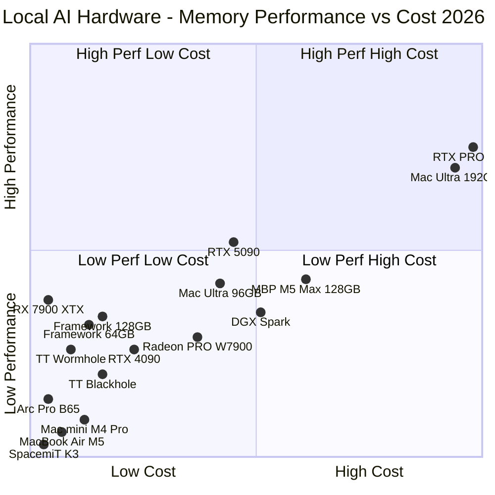

Nobody buying AI hardware in 2026 is short on opinions. Everyone has a take. The forums are full of people who swear by their setup and can't understand why anyone would choose differently. Most of those arguments are happening across completely different use cases which raises the noise floor for this subject.

<!--more-->

"What's the best hardware for running AI locally?" is roughly as useful as asking what's the best vehicle without mentioning whether you're hauling gravel or commuting to an office. The answer depends entirely on what you're trying to do, and getting that wrong wastes real money.

Here's my attempt to cut through it.

## The three things that actually matter

Local AI hardware comes down to three variables: capacity, bandwidth, and software stack.

**Capacity** is whether the model fits in memory at all. If it doesn't fit, nothing else matters. You're either offloading to disk (more on that disaster in a bit) or you need a bigger box.

**Bandwidth** is how fast the hardware can feed data to the compute units. This is the single best first-pass predictor of how fast tokens actually come out. Memory bandwidth is not the same as tokens per second, but it's the cleanest way to sort real performance tiers before you waste a weekend arguing with someone posting single-prompt screenshots.

**Software stack** is how much of the spec sheet you can actually cash out. A card with strong bandwidth numbers on paper does nothing useful if the inference framework doesn't support it. This is still where CUDA's dominance matters, and it's where Tenstorrent's fully open source stack is a genuine long-term bet worth watching.

## The hardware landscape

Five distinct markets, same buzzword. Here's what each one is actually good for.

### Raw speed when the model fits: discrete GPUs

If the model fits in VRAM, discrete GPUs are still the fastest thing by a wide margin. Nothing else comes close on a per-token basis.

NVIDIA's RTX PRO 6000 Blackwell (96GB, 1792 GB/s, around $8,000 to $9,200 retail right now) and the RTX 5090 (32GB, 1792 GB/s, street price has been running $3,000 to $5,000 and climbing due to supply issues) share identical bandwidth. The difference is capacity. The PRO 6000 can hold a 70B model at Q4 comfortably and will push around 100 to 120 tok/s on it; the 5090 tops out around 30B quantized but hits 150 to 200 tok/s on 8B models where bandwidth and VRAM both cooperate. The RTX 4090 (24GB, 1008 GB/s) runs around 80 to 100 tok/s on 8B and is still worth knowing about if you find one at a good price on the secondary market.

AMD's discrete cards deserve more credit than they typically get. The RX 7900 XTX (24GB, 960 GB/s) is genuinely competitive on bandwidth per dollar. The Radeon PRO W7900 (48GB, 864 GB/s) doubles the memory at workstation pricing. The newer AI PRO R9700 (32GB, 640 GB/s) sits in between. ROCm support has improved enough that AMD is a real option now, especially with llama.cpp and Ollama.

Intel showed up too. The Arc Pro B65 (32GB, ~608 GB/s) and B60 (24GB, ~456 GB/s) are interesting if you're following where Intel's headed with this. Not my first choice today, but they're not irrelevant.

Discrete GPUs win because they can drink from a firehose. They lose the moment the model doesn't fit.

### Biggest one-box memory: Apple Silicon

Apple's pitch is simple: not the fastest, but more unified memory in a quiet box than anything else you can buy.

The Mac Studio M3 Ultra is still the headliner here. Up to 512GB of unified memory at 819 GB/s. That's enough to run a Llama 4 Maverick (400B MoE) at quantization, or DeepSeek-V3 (671B MoE) with aggressive quantization. Nothing else in a single consumer box gets anywhere near that capacity. The 512GB config is reportedly hard to find right now. Apple briefly pulled that upgrade option but the 96GB base config starts around $3,999 and the 192GB/256GB configs sit in the $6,000 to $10,000 range depending on CPU tier.

Below that you've got the Mac Studio M4 Max (up to 128GB, 546 GB/s, from around $2,000), which does about 20 to 25 tok/s on a 70B Q4 model and around 50 tok/s on 8B. The MacBook Pro M5 Max (up to 128GB, 460 to 614 GB/s, from around $3,900) is in the same ballpark. The MacBook Pro M5 Pro (up to 64GB, 307 GB/s, from around $2,200) lands around 10 to 15 tok/s on 70B when it fits. The Mac mini M4 Pro (up to 64GB, 273 GB/s, from around $1,400) is at the bottom of this tier, roughly 5 to 8 tok/s on 70B (usable for background work, slow for interactive use).

Apple wins when you want one box, you want silence, and you want to run models that simply won't fit on a normal GPU. It loses when raw tokens per second and concurrency start to matter more than everything else.

### Coherent NVIDIA appliance: DGX Spark and RTX Spark

The DGX Spark (128GB unified, 273 GB/s) launched at $3,999 and has since been bumped to $4,699 due to memory supply constraints. It's not a bandwidth monster. It's a compact NVIDIA CUDA appliance with 128GB of coherent memory and NVFP4 support that hasn't fully matured yet but is genuinely interesting for the future of quantization.

NVIDIA just announced the RTX Spark at Computex 2026, and it's essentially the same architectural premise in a consumer form factor. The RTX Spark is a superchip (Grace ARM CPU with up to 20 cores, Blackwell GPU with 6,144 CUDA cores, up to 128GB unified LPDDR5X) built for Windows laptops and compact desktops, co-developed with Microsoft. OEMs including ASUS, Dell, HP, Lenovo, and Microsoft Surface are targeting fall 2026. This is the first time the full CUDA stack ships inside a thin Windows laptop, which is genuinely new even if the rest of the specs feel familiar.

The bandwidth story is the same as the DGX Spark: 273 GB/s from LPDDR5X, which puts real numbers on the table. On a 70B Q4 model, the DGX Spark decodes at around 3 tok/s. On 8B it's around 40 to 50 tok/s, where smaller models are more compute-bound so the CUDA advantage shows up. The Mac Studio M4 Max at $2,000 does 20 to 25 tok/s on 70B (6 to 8x faster on the large model that actually justifies the 128GB box) and is likely cheaper than a premium RTX Spark laptop will land.

NVIDIA is also marketing the RTX Spark with a [1 petaflop of AI performance](https://nvidianews.nvidia.com/news/nvidia-microsoft-windows-pcs-agents-rtx-spark) claim, which is technically accurate the same way claiming a car "can go 150 mph" on a track under ideal conditions is technically accurate. That figure is FP4 with structured sparsity enabled, a 2x multiplier that only applies when model weights are at least 50% zeros. Most aren't. At FP16 it's closer to 250 teraflops. I've already noted the same trick for the RTX 4090 (1,321 TOPS with sparsity vs. around 660 dense) in the TOPS section below, but the RTX Spark version is more brazen because the gap is bigger and the format (FP4) is less established in real inference pipelines.

Pricing for RTX Spark consumer devices isn't confirmed yet, but premium laptops will likely land somewhere in the $2,000 to $3,500 range given TSMC 3nm fabrication and LPDDR5X memory costs. If that holds, the value proposition against a Mac Studio M4 Max is rough: same memory, half the bandwidth, different OS, and CUDA dependency to justify the premium. The CUDA software story is real and matters to developers who need it. But if you're just running inference, the bandwidth gap follows you everywhere.

There's also the Windows on ARM compatibility question, which has a rough history. The Surface RT (2012) was a fiasco, Windows 10 ARM limped along for years with an emulation layer that was slow and incomplete, and even the first Snapdragon X Elite machines in 2024 had real gaps in driver support. The current picture is genuinely better. Windows 11's Prism emulator runs most x86 apps with around 10 to 15% overhead, and [over 93% of commonly used apps run natively](https://witechpedia.com/windows-on-arm-app-compatibility/) as of early 2026. The remaining compatibility failures are almost entirely kernel-mode drivers: anti-cheat software, some security tools, legacy hardware drivers. Jensen Huang claimed at Computex that RTX Spark will run "every Windows app ever made," which is the kind of thing a CEO says at a keynote and which the kernel-mode driver situation makes not quite true. For most users running standard productivity and developer software, the platform is fine. If you depend on specific kernel-level tooling (corporate endpoint security with no ARM64 driver, game anti-cheat, some DAW plugins), you'll want to check before buying.

NVIDIA's roadmap has Vera Rubin with LPDDR6 memory after this, which should improve the bandwidth ceiling meaningfully. The first-generation RTX Spark is an interesting platform bet, not a current-generation performance win.

Both the DGX Spark and RTX Spark are developer appliances first. Full NVIDIA stack, 128GB in a small box, not optimizing for raw decode speed. The GB10-class machines like the ASUS Ascent GX10 belong here too.

### First real x86 unified-memory contender: Strix Halo

AMD's Ryzen AI Max / Strix Halo is the most interesting new category in local AI hardware, in my opinion. Up to 128GB of LPDDR5X at ~256 GB/s, with up to ~96GB assignable as GPU memory on Windows. The Framework Desktop implements this starting at $1,099 for 32GB, $1,599 for 64GB, and $1,999 for the 128GB config. Real-world decode on a Llama 70B Q4 model lands around 4 to 5 tok/s, similar to the DGX Spark and well below the Mac Studio M4 Max (same bandwidth ceiling, same result). On 8B models it does around 40 to 45 tok/s, comfortable for interactive use.

This is not just another mini PC. It's the first mainstream x86 box where local AI starts feeling like a serious hardware class rather than a laptop pretending very hard. The value proposition at 128GB for $1,999 is hard to beat, especially if you're running MoE models where capacity matters more than raw bandwidth. You're paying for the ability to load the model, not for fast decode once it's loaded.

### The fully open source bet: Tenstorrent

Tenstorrent's Wormhole n300 (24GB, 576 GB/s, around $1,400) and Blackhole p150 (32GB, 512 GB/s, around $1,400 with 800G interconnect) run a fully open source stack from top to bottom. I'm genuinely rooting for this one to mature. The AI world needs more fully open stacks, and the bandwidth is competitive with mid-tier discrete GPUs. The Blackhole's interconnect makes multi-card scaling worth watching as the software ecosystem develops.

### RISC-V: SpacemiT K3

SpacemiT is a Chinese fabless semiconductor company that has been quietly building a RISC-V roadmap worth checking out. Their K1 chip shipped over 150,000 units, which is an unusually high number for RISC-V. The K3 is their follow-up, and it's a meaningful step up.

The K3 packages eight X100 RISC-V CPU cores (up to 2.4 GHz) and eight A100 AI cores into a single SoC, with RVA23 compliance (RISC-V standard), LPDDR5-6400 (low powered memory), and 60 TOPS of AI compute at INT8/FP8/FP16/BF16. For context: the K1 topped out at 2 TOPS and 16GB of LPDDR4. The K3 is a 30x jump in AI performance and doubles the max memory to 32GB.

The 60 TOPS figure comes from the A100 AI core cluster, not a discrete NPU. SpacemiT claims the platform can run a 30B-parameter model at more than 10 tokens/second. I'd wait for independent benchmarks before taking that at face value, but at least the claim is specific enough to be falsifiable.

Early CPU benchmarks from CNX-Software (January 2026) show multi-core 7-Zip performance slightly better than a Rockchip RK3588, single-core slightly below a Raspberry Pi 5. Memory bandwidth (memcpy ~5,947 MB/s) is closer to Pi 5 territory than RK3588. AES-256 single-core performance lags both. Competitive general-purpose compute for a RISC-V chip, not competitive with ARM at the same price point. Not yet.

**K3-based boards coming to market**

Several boards are either shipping or in active pre-order as of May 2026:

| Board | Maker | Price | RAM | Status | Key I/O |
|---|---|---|---|---|---|
| [Jupiter 2](https://milkv.io/jupiter2) | Milk-V | $300--$575 | 8/16/32GB LPDDR5 | Pre-order | 10GbE SFP+, PCIe Gen3 x4, Wi-Fi 6, M.2 NVMe |
| [BPI-SM10 Dev Kit](https://forum.banana-pi.org/t/banana-pi-major-release-based-on-spacemit-k3-launching-bpi-sm10-developer-kit-and-k3-pico-itx-sbc/27238) | Banana Pi | TBD | up to 32GB LPDDR5 | Announced | Compute module format |
| [K3 Pico-ITX SBC](https://www.cnx-software.com/2026/05/11/rva23-pico-itx-sbc-spacemit-k3-octa-core-risc-v-ai-soc-up-to-32gb-ram-256gb-ufs/) | SpacemiT/Sipeed | $299+ | up to 32GB LPDDR5 | Shipping | 10GbE, UFS up to 256GB, M.2 NVMe |
| [AIBOX-K3](https://www.cnx-software.com/2026/05/12/firefly-aibox-k3-an-edge-ai-mini-pc-powered-by-spacemit-k3-risc-v-soc/) | Firefly | $349--$689 | 8/32GB | Available | Industrial edge AI box, fanless |
| [DC-ROMA Mainboard III](https://deepcomputing.io/dc-roma-risc-v-mainboard-iii-unveiled-at-fosdem-powered-by-spacemit-k3-for-framework-laptop-13/) | DeepComputing | $699--$999 | 16/32GB LPDDR5 | Pre-order (ships June 2026) | Framework Laptop 13 drop-in mainboard |

The Milk-V Jupiter 2 is the most compelling entry point at $300 for 8GB: Pico-ITX form factor, 10GbE SFP+, PCIe Gen3 x4, Wi-Fi 6/BT 5.2, and an aluminum enclosure with a built-in fan. The DeepComputing board is a different thing entirely. It turns a Framework Laptop 13 into a RISC-V laptop, which is either a compelling experiment or a $699 curiosity depending on your use case. Firefly also announced the CSC2-N48SPK3, a 2U rack server with 48 K3 nodes (2,880 TOPS aggregate) starting around $38,800. That one is squarely for researchers and the "I want a RISC-V cluster" crowd.

**Linux and inference stack**

The K3 is RVA23-compliant, which matters because Ubuntu 25.10 and later mandate RVA23. The K1 was excluded; the K3 is not. Canonical officially supports Ubuntu 26.04 LTS on K3 platforms. The kernel shipping on current hardware is 6.12.16. Initial mainline support (device tree sources under `arch/riscv/boot/dts/spacemit/`) landed in Linux 7.0, with peripheral driver expansion queued for 7.1.

RVV 1.0 is implemented with 256-bit vector registers per core. For llama.cpp specifically: SpacemiT's `bianbu` downstream fork has the best-optimized build path, since peak AI performance requires their GCC toolchain. Upstream llama.cpp has RISC-V RVV support, but expect lower throughput until the A100 AI core backend matures further.

**Who this is for**

Hobbyists, RISC-V ecosystem enthusiasts, and developers who want to build or test RISC-V-native software. If you're comparing the Jupiter 2 against a Raspberry Pi 5 or Orange Pi 5 on pure price/performance, you'll be disappointed. If you're deliberately targeting a non-ARM, non-x86 architecture (for software portability work, embedded Linux development, or just the novelty of running actual LLM inference on RISC-V hardware), the K3 is the most capable option shipping today.

### The AI PC trap

Most machines wearing an "AI PC" sticker are still bandwidth-starved in any practical sense. Snapdragon X Elite (~135 GB/s), Intel Lunar Lake (~136 GB/s), MacBook Air M5 (~153 GB/s), Snapdragon X2 Elite (~152 to 228 GB/s depending on SKU). On an 8B Q4 model you're looking at 15 to 25 tok/s, which is usable. Try to push a 13B dense model and you're dropping below 15 tok/s on most of these. Anything bigger either doesn't fit or crawls. These are fine machines for small models, personal assistants, edge workloads. They are not serious local inference hardware for anything larger than a 7 to 8B dense model. Physics still applies, which is inconvenient but consistent.

## The gimmicks section (or: technically possible doesn't mean useful)

A pattern keeps coming up in local AI discussions that costs people real time and money chasing something that doesn't work well in practice.

The pitch goes like this: "My hardware doesn't have enough memory, but I can still run a big model by only loading part of it at a time." This is usually presented as a clever hack. Sometimes it is. More often it's a performance cliff dressed up as a feature.

**Layer offloading.** Tools like llama.cpp let you split model layers between GPU VRAM, system RAM, and even disk. The flag is `-ngl` (number of GPU layers). When you don't have enough VRAM for the whole model, you offload some layers to CPU RAM. The problem is that every token generation step has to shuffle data across the PCIe bus between GPU and CPU. Real-world numbers here are brutal, people running 70B models with partial CPU offloading report around 1 to 3 tokens per second. That's technically running the model. It's also roughly the speed of reading text out loud to yourself. Not useful for interactive work.

**Disk offloading.** Some tools and frameworks support streaming model weights from NVMe directly. Modern NVMe drives can hit 7 GB/s reads in ideal conditions, which sounds fast until you realize your GPU memory bandwidth is 10 to 100x that. The energy penalty alone is significant, recent research puts SSD-offloaded decode at roughly 3 to 4x the energy cost versus in-memory inference on comparable hardware. Token generation with disk offload in practice tends to land below 1 token per second. I've seen people run 405B models this way. I've also seen them wait two minutes for a 60-token response.

**Extreme quantization.** Q4 is excellent, Q5 and Q8 are great when you can afford the memory for them. The cliff is at the bottom. Q2 quantization degrades quality enough that for many use cases you'd be better off running a smaller, better-quantized model. A Q2 70B model often loses to a Q4 7B on reasoning tasks while using four times the memory. The tradeoff is real.

**The 30 tokens-per-second floor.** For interactive use, actual back-and-forth conversation or coding assistance where you're watching the output stream, 30 tok/s is roughly where it starts feeling like a tool rather than a waiting exercise. Below 15 tok/s it becomes noticeable. Below 5 tok/s it's painful regardless of model quality. For batch processing or background tasks, slower is tolerable. But if you're evaluating a hardware setup for daily driving, "it runs" and "it's usable" are different things.

The test I'd apply: if your setup produces tokens slower than you read them, you're probably past the gimmick threshold for interactive use.

## What models are you actually trying to run?

Hardware decisions only make sense relative to the models you're targeting. Open source models in 2026 have gotten genuinely good, close enough to frontier API models on many tasks that the conversation has shifted from "is open source good enough?" to "which open source model is right for this?"

The big architectural shift is MoE (Mixture of Experts). These models have enormous total parameter counts but only activate a fraction of them per token. That changes the capacity-vs-speed tradeoff dramatically. A model that "needs" 192GB to load might only activate 17B parameters per forward pass.

**24 to 32GB (RTX 5090, RX 7900 XTX, Arc Pro B65, MacBook Air M5 max):** This is Llama 4 Scout territory at Q4 (109B total, 17B active, fits in roughly 55 to 60GB quantized, so you need a second GPU or larger box), or more realistically: Qwen3 30B-A3B (only 3B active per token), Gemma 4 26B MoE (~14GB at Q4, 85+ tok/s on consumer hardware, genuinely excellent for the size), Phi-4 14B for reasoning, and Qwen2.5-Coder 14B for coding work. Useful territory, not the frontier.

**48 to 64GB (Mac Studio M4 Max, MacBook Pro M5 Pro, Framework Desktop 64GB):** Dense 30 to 40B models at Q4 land comfortably here. Llama 4 Scout (109B MoE, 17B active) fits at reasonable quantization. Qwen3 235B-A22B MoE needs more room, but the smaller Qwen3 variants are excellent here. This is where local AI starts feeling like a real tool rather than an experiment.

**96 to 128GB (RTX PRO 6000, Mac Studio M3 Ultra base, DGX Spark, Framework Desktop 128GB):** Llama 4 Scout at Q8, DeepSeek-R1 70B for serious reasoning, Qwen3 235B-A22B MoE with 22B active parameters. The DGX Spark's CUDA stack gives it an edge for frameworks that are optimized for NVIDIA. GPT-OSS-120B (OpenAI's first open-weights release in years) also fits here. Single 80GB GPU in FP8, or 128GB unified at Q4.

**192 to 512GB (Mac Studio M3 Ultra maxed, multi-GPU rigs):** Llama 4 Maverick (400B MoE, 17B active), DeepSeek-V3 (671B MoE) at aggressive quantization, Qwen3 235B at higher precision. If you need frontier-class open source models running locally with zero cloud dependency, this is currently the only consumer-ish path to get there.

## The quadrant chart

Here's how these platforms map when you combine memory capacity, bandwidth, and cost into a single picture. The vertical axis is a synthesized "memory performance" score explained in detail in the collapsed section below. The horizontal axis is platform cost. Only min and max configs are shown for platforms with multiple options.



<details>
<summary>How the memory performance score is calculated + data table</summary>

The score on the vertical axis synthesizes two things: memory capacity (GB) and memory bandwidth (GB/s). Neither alone tells the full story. A box with massive bandwidth but tiny capacity runs out of useful models quickly, and a box with massive capacity but slow bandwidth produces tokens at a crawl.

**Scoring method:**

I normalized both dimensions independently across the full set of platforms (0 = worst in set, 1 = best in set), then combined them with equal weighting (50/50). The formula is:

```
capacity_score = (GB - min_GB) / (max_GB - min_GB)
bandwidth_score = (GB_s - min_GB_s) / (max_GB_s - min_GB_s)
memory_performance = (capacity_score + bandwidth_score) / 2
```

The dataset spans 24GB (low end) to 192GB (practical max shown) for capacity, and 153 GB/s (MacBook Air M5) to 1792 GB/s (RTX 5090 / PRO 6000) for bandwidth.

**Cost axis:** Normalized from ~$750 (Arc Pro B65) to ~$8,500 (RTX PRO 6000). I used street price midpoints where ranges exist.

| Platform | Memory (GB) | Bandwidth (GB/s) | Cap Score | BW Score | Mem Score | Cost ($) | Cost Score |
|---|---|---|---|---|---|---|---|
| RTX PRO 6000 | 96 | 1792 | 0.43 | 1.00 | 0.71 | 8,500 | 1.00 |
| Mac Studio M3 Ultra 192GB | 192 | 819 | 1.00 | 0.41 | 0.70 | 8,000 | 0.94 |
| RTX 5090 | 32 | 1792 | 0.05 | 1.00 | 0.52 | 4,200 | 0.45 |
| MacBook Pro M5 Max 128GB | 128 | 546 | 0.62 | 0.24 | 0.43 | 5,500 | 0.61 |
| Mac Studio M3 Ultra 96GB | 96 | 819 | 0.43 | 0.41 | 0.42 | 3,999 | 0.42 |
| DGX Spark | 128 | 273 | 0.62 | 0.07 | 0.35 | 4,699 | 0.51 |
| Framework 128GB | 128 | 256 | 0.62 | 0.06 | 0.34 | 1,999 | 0.16 |
| Radeon PRO W7900 | 48 | 864 | 0.14 | 0.43 | 0.29 | 3,600 | 0.37 |
| RTX 4090 | 24 | 1008 | 0.00 | 0.52 | 0.26 | 2,500 | 0.23 |
| RX 7900 XTX | 24 | 960 | 0.00 | 0.49 | 0.25 | 950 | 0.03 |
| Mac mini M4 Pro 64GB | 64 | 273 | 0.24 | 0.07 | 0.16 | 1,400 | 0.08 |
| Arc Pro B65 | 32 | 608 | 0.05 | 0.28 | 0.16 | 750 | 0.00 |
| Framework 64GB | 64 | 256 | 0.24 | 0.06 | 0.15 | 1,599 | 0.11 |
| TT Blackhole p150 | 32 | 512 | 0.05 | 0.22 | 0.13 | 1,400 | 0.08 |
| TT Wormhole n300 | 24 | 576 | 0.00 | 0.26 | 0.13 | 1,400 | 0.08 |
| MacBook Air M5 32GB | 32 | 153 | 0.05 | 0.00 | 0.02 | 1,100 | 0.05 |
| SpacemiT K3 Pico-ITX (8GB) | 8 | ~51† | 0.00 | 0.00 | 0.00 | 299 | 0.00 |
| Milk-V Jupiter 2 (8GB) | 8 | ~51† | 0.00 | 0.00 | 0.00 | 300 | 0.00 |

Note: Cap Score of 0.00 for 24GB cards means that's the minimum in the dataset, not that they have no capacity. Everything is relative to the range of platforms compared here.

†SpacemiT K3 LPDDR5-6400 theoretical peak bandwidth is ~51 GB/s on a 32-bit bus. Both K3 boards score 0.00 on this scale because they sit well below the dataset minimum (153 GB/s). They belong in a different tier entirely, the chart reflects that. See the RISC-V section above for context on what these boards are actually for.

</details>


A few things jump out. The RX 7900 XTX is the best value pure-bandwidth play if 24GB is enough for your models. The Framework 128GB is quietly the best price-to-capacity ratio in the whole field. The bandwidth score drags it down but nothing else gives you 128GB assignable to a GPU for $1,999. The DGX Spark is the most interesting chart anomaly: high capacity, middling bandwidth, high cost, and a software stack that might eventually justify all of it. The Mac Studio M3 Ultra at 192GB represents the upper right of what's achievable in a single consumer box, and the price reflects it.

## Understanding TOPS

Every AI chip ships with a TOPS number. TOPS stands for Tera Operations Per Second (one trillion integer operations per second). It sounds like a clean unit, and it is, as far as it goes.

The problems start when you try to compare TOPS numbers across vendors.

TOPS is almost always measured at INT8 precision, 8-bit integer arithmetic. INT8 is common in quantized inference because it's faster and cheaper than FP32, and accuracy loss is usually acceptable. But vendors quote peak theoretical TOPS under ideal conditions: perfectly parallelized workloads, full hardware utilization, no memory stalls, supported operators only.

Real LLM inference rarely hits that ceiling. Memory bandwidth is usually the bottleneck, not compute. A large language model spends most of its time moving weights between memory and compute units, and if those weights don't fit in fast on-chip memory (they usually don't), you're waiting on DRAM bandwidth regardless of how fast the arithmetic units are.

There's also a precision equivalence problem. Apple quotes its Neural Engine at 38 TOPS for the M4, but that figure comes from counting INT8 operations as 2x the FP16 rate. That's industry convention, not necessarily hardware reality. The ANE dequantizes INT8 weights to FP16 before compute, so the 2x multiplier is partly accounting. A 38 TOPS ANE and a 38 TOPS NPU from a different vendor are not the same thing.

The bigger issue is software maturity. A 2 TOPS NPU with mature, optimized software will outperform a 26 TOPS NPU with poor framework support for most real-world workloads. Apple's Neural Engine is the clearest example: Core ML and the ANE runtime are deeply co-designed, operator coverage is comprehensive, and the toolchain handles quantization automatically. A Hailo-8 at 26 TOPS needs Hailo's SDK and specific model conversion, operator coverage gaps are real and documented. For RISC-V platforms like the K3, the AI core stack is still maturing. The hardware headroom is there, but the software to actually cash out 60 TOPS on arbitrary LLM workloads isn't yet at Apple's or NVIDIA's level.

**Cross-platform TOPS comparison**

| Platform | TOPS | Precision | Scope | Notes |
|---|---|---|---|---|
| SpacemiT K1 | 2 | INT8 | AI cores | 8-core RISC-V, K3 predecessor |
| SpacemiT K3 | 60 | INT4/INT8/FP8/FP16/BF16 | 8 A100 AI cores | RVA23 RISC-V; software stack still maturing |
| Hailo-8L | 13 | INT8 | Dedicated NPU | Used in Raspberry Pi AI HAT+ |
| Hailo-8 | 26 | INT8 | Dedicated NPU | M.2 accelerator; ~2.5W; SDK-dependent |
| Apple M3 Neural Engine | 18 | FP16 | NPU only | 16-core ANE; mature Core ML stack |
| Apple M3 Ultra Neural Engine | ~36 | FP16 | NPU only | 32-core ANE (2x M3 die); estimated |
| Apple M4 Neural Engine | 38 | INT8 (conv.) | NPU only | Per Apple; INT8 to FP16 dequant in practice |
| Intel Core Ultra (Lunar Lake) | ~47 | INT8 | NPU only | Core Ultra 9 288V; Copilot+ certified |
| Qualcomm Snapdragon X Elite | 45 | INT8 | NPU only | Hexagon NPU; Windows on ARM |
| Qualcomm Snapdragon X2 Elite | 80 | INT8 | NPU only | Latest gen (2025); 78% jump over X Elite |
| Tenstorrent Wormhole n150 | ~262 TFLOPs | FP8 | Full chip | Not a traditional TOPS figure; 72 Tensix cores |
| NVIDIA RTX 4090 | 1,321 | INT8 w/ sparsity | GPU tensor | Includes structured sparsity 2x multiplier |
| NVIDIA RTX 5090 | ~3,352 | INT8 w/ sparsity | GPU tensor | With sparsity; ~1,677 TOPS dense |

A few things worth calling out: the RTX 4090's 1,321 TOPS includes structured sparsity, a 2x multiplier that only applies when model weights are 50% or more zero. Most aren't. NVIDIA's dense INT8 is closer to 660 TOPS. The Tenstorrent Wormhole reports FP8 TFLOPs rather than TOPS, which reflects a different architectural philosophy entirely. The SpacemiT K3's 60 TOPS is dependent on a software stack that's still being built.

Raw TOPS is a starting point, not an answer. Match the platform to the workload, check framework support for your model architecture, and benchmark before committing.

## Which bottleneck are you buying?

Stop asking which hardware is best. Start asking which bottleneck you're willing to pay to solve.

If you're doing multi-agent workflows where you need fast concurrent inference, with multiple agents running in parallel each waiting on responses, bandwidth wins and you want discrete NVIDIA. If you're running a single large reasoning model for deep analysis or long-context work, capacity wins and you want unified memory. If you're experimenting and want the best flexibility per dollar, the Framework Desktop at 128GB or a Mac mini M4 Pro are hard to beat as starting points.

The local AI hardware market in 2026 is finally interesting enough that there's no single right answer, which means the space has matured past the point where CUDA was the only viable path and a $10,000 GPU was the only serious option.

## Sources and where to buy

### Primary references

- [NVIDIA RTX PRO 6000 Blackwell](https://www.nvidia.com/en-us/design-visualization/rtx-pro-6000/)
- [NVIDIA RTX 5090](https://www.nvidia.com/en-us/geforce/graphics-cards/50-series/rtx-5090/)
- [NVIDIA DGX Spark](https://www.nvidia.com/en-us/products/workstations/dgx-spark/)
- [NVIDIA RTX Spark](https://www.nvidia.com/en-us/products/rtx-spark/)
- [NVIDIA RTX Spark announcement](https://nvidianews.nvidia.com/news/nvidia-microsoft-windows-pcs-agents-rtx-spark)
- [Apple Mac Studio](https://www.apple.com/mac-studio/)
- [Apple MacBook Pro](https://www.apple.com/macbook-pro/)
- [Apple Mac mini](https://www.apple.com/mac-mini/)
- [AMD Ryzen AI Max (Strix Halo)](https://www.amd.com/en/products/processors/laptop/ryzen/ryzen-ai-max.html)
- [Framework Desktop](https://frame.work/desktop)
- [AMD Radeon PRO W7900](https://www.amd.com/en/products/graphics/workstations/radeon-pro/w7900.html)
- [AMD Radeon AI PRO R9700](https://www.amd.com/en/products/graphics/workstations/radeon-pro/radeon-ai-pro-r9700.html)
- [Intel Arc Pro B-Series](https://www.intel.com/content/www/us/en/products/docs/discrete-gpus/arc/workstation/pro-b-series.html)
- [Tenstorrent Blackhole](https://tenstorrent.com/en/hardware/blackhole)
- [Tenstorrent Wormhole](https://tenstorrent.com/en/hardware/wormhole)
- [SpacemiT K3 specs brief](https://cdn-resource.spacemit.com/file/chip/K3/K3_brief_en.pdf)
- [SpacemiT K3 early benchmarks (CNX Software)](https://www.cnx-software.com/2026/01/23/spacemit-k3-16-core-risc-v-soc-system-information-and-early-benchmarks/)
- [K3 Pico-ITX SBC (CNX Software)](https://www.cnx-software.com/2026/05/11/rva23-pico-itx-sbc-spacemit-k3-octa-core-risc-v-ai-soc-up-to-32gb-ram-256gb-ufs/)
- [Firefly AIBOX-K3 (CNX Software)](https://www.cnx-software.com/2026/05/12/firefly-aibox-k3-an-edge-ai-mini-pc-powered-by-spacemit-k3-risc-v-soc/)
- [DeepComputing DC-ROMA III (CNX Software)](https://www.cnx-software.com/2026/05/13/spacemit-k3-powered-dc-roma-risc-v-motherboard-iii-is-made-for-the-framework-laptop-13/)
- [Canonical Ubuntu on K3/K1](https://canonical.com/blog/spacemit-announces-availability-of-ubuntu-on-k3-k1-series)
- [Meta Llama 4](https://ai.meta.com/blog/llama-4-multimodal-intelligence/)
- [Qwen3 technical report](https://arxiv.org/html/2505.09388v1)
- [NVIDIA on Llama 4 inference](https://developer.nvidia.com/blog/nvidia-accelerates-inference-on-meta-llama-4-scout-and-maverick/)
- [RTX PRO 6000 pricing detail](https://www.thundercompute.com/blog/nvidia-rtx-pro-6000-pricing)
- [DGX Spark price change](https://forums.developer.nvidia.com/t/2-23-2026-price-change-announcement/361713)

### Where to buy

- **NVIDIA RTX 5090** -- [Best Buy](https://www.bestbuy.com/site/searchpage.jsp?st=RTX+5090), [Newegg](https://www.newegg.com/p/N82E16814133983), [B&H Photo](https://www.bhphotovideo.com/c/product/1798852-REG) (stock is spotty, prices above MSRP)
- **NVIDIA RTX PRO 6000 Blackwell** -- [Newegg](https://www.newegg.com/p/1FT-000S-003H5), [Amazon RTX PRO 6000](https://www.amazon.com/s?k=RTX+PRO+6000+Blackwell), [Micro Center](https://www.microcenter.com/search/search_results.aspx?Ntt=RTX+PRO+6000), [B&H Photo RTX PRO 6000](https://www.bhphotovideo.com/c/search?q=RTX+PRO+6000&sort=PRICE_LOW_TO_HIGH)
- **RTX 4090** -- secondary market, [eBay RTX 4090](https://www.ebay.com/sch/i.html?_nkw=RTX+4090+GPU), [Newegg used](https://www.newegg.com/p/N82E16814133937)
- **Apple Mac Studio** -- [Mac Studio 128GB config](https://www.apple.com/shop/buy-mac/mac-studio), [Mac Studio 192GB config](https://www.apple.com/shop/buy-mac/mac-studio)
- **Apple MacBook Pro** -- [MacBook Pro 16" M5 Max 128GB](https://www.apple.com/shop/buy-mac/macbook-pro)
- **Apple Mac mini** -- [Mac mini M4 Pro config selector](https://www.apple.com/shop/buy-mac/mac-mini)
- **Apple MacBook Air** -- [MacBook Air M5 configs](https://www.apple.com/shop/buy-mac/macbook-air)
- **NVIDIA DGX Spark** -- [NVIDIA Marketplace direct](https://marketplace.nvidia.com/en-us/enterprise/personal-ai-supercomputers/dgx-spark/) (enterprise ordering)
- **ASUS Ascent GX10** -- [ASUS store](https://www.asus.com/us/commercial-servers/asus-ascent-gx10/) (system integrator quotes)
- **Framework Desktop** -- [Framework order page](https://frame.work/desktop) (direct from manufacturer, 128GB config available)
- **AMD RX 7900 XTX** -- [Newegg RX 7900 XTX](https://www.newegg.com/p/N82E16814161643), [Amazon RX 7900 XTX](https://www.amazon.com/s?k=RX+7900+XTX), [B&H Photo RX 7900 XTX](https://www.bhphotovideo.com/c/search?q=RX+7900+XTX)
- **AMD Radeon PRO W7900** -- [AMD.com Radeon PRO](https://www.amd.com/en/products/graphics/workstations/radeon-pro/w7900.html), [CDW PRO W7900](https://www.cdw.com/search/?searchscope=all&keyword=Radeon+PRO+W7900), [B&H Photo PRO W7900](https://www.bhphotovideo.com/c/search?q=Radeon+PRO+W7900)
- **AMD Radeon AI PRO R9700** -- [AMD.com AI PRO](https://www.amd.com/en/products/graphics/workstations/radeon-pro/radeon-ai-pro-r9700.html), [CDW R9700](https://www.cdw.com/search/?searchscope=all&keyword=Radeon+AI+PRO+R9700)
- **Intel Arc Pro B65** -- [Intel Arc Pro B-series](https://www.intel.com/content/www/us/en/ark/products/code/244396/intel-arc-pro-b65.html), [CDW Arc Pro B65](https://www.cdw.com/search/?searchscope=all&keyword=Intel+Arc+Pro+B65)
- **Tenstorrent Wormhole / Blackhole** -- [Tenstorrent store](https://tenstorrent.com/en/store) (direct ordering)
