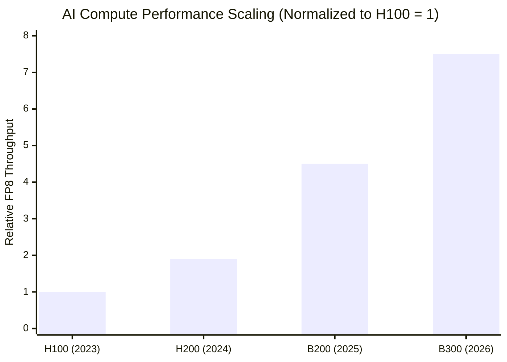
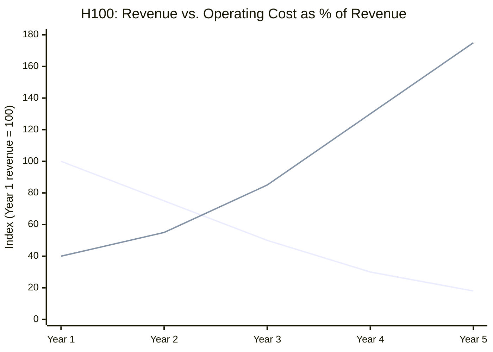

There's a number that comes up constantly in AI coverage: the size of the capex commitment. Microsoft, Google, Meta, Amazon, collectively spending hundreds of billions on AI infrastructure. The implicit assumption in most of that coverage is that more spending equals more capability equals more future value. That's not wrong, but it leaves out all the interesting parts.

The real question isn't how much you're spending. It's what you're actually buying, how fast it depreciates (in practice, not on paper), and how the economics shift over the hardware lifetime compared to what you could have deployed instead. Those are three separate variables that interact in non-obvious ways.

<!--more-->

## The Building Itself Is Expensive and Getting More Expensive Fast

Before a single GPU gets installed, you need a facility. Not a regular datacenter, an AI datacenter, which means high-density power delivery, liquid cooling, and structural requirements that didn't exist five years ago. For AI infrastructure, the right unit to think in is cost per megawatt of capacity, because power density is the actual constraint. Sqft matters too, but a traditional datacenter might provision 5 to 10kW per rack while an AI facility runs 100kW per rack or more. You're not buying floor space, you're buying powered, cooled floor space.

| Year | AI DC ($/sqft) | AI DC ($/MW) | YoY ($/MW) |
|------|---------------|--------------|------------|
| 2023 | ~$700 | ~$10M | baseline |
| 2024 | ~$800 | ~$14M | +40% |
| 2025 | ~$1,100 | ~$20M | +43% |
| 2026 | ~$1,500+ | ~$28M+ | +40% |

Both metrics are climbing, but per-MW is rising faster because each generation of AI hardware packs more power into the same floor space. The [cost per square foot](https://thenetworkinstallers.com/blog/data-center-construction-statistics/) broke $1,000 for the first time in 2025, roughly double 2023. Per-MW costs have nearly tripled over the same period. All-in costs including GPU hardware push the per-MW number to $30 to 40 million today.

Two things are driving this. First, AI chips are power-hungry and dense in ways that older datacenter designs didn't anticipate. Second, construction labor and materials costs haven't come down from their post-pandemic highs, and the competition for workers who know how to build these things has gotten fierce.

Both costs are going up every year, and next-gen hardware runs hotter and denser, so the next build will cost more still.

## What It Actually Costs to Deploy a GPU Slot

The facility cost per MW is one number. What that translates to per GPU slot is the one that matters for the economics, and it's been climbing faster than the per-MW headline suggests because each generation of hardware is denser.

An H100 at 700W GPU draw means roughly 1,200 H100 slots per megawatt of facility capacity once you account for PUE overhead (at PUE 1.2, roughly 833kW of IT load per MW of facility power, divided by ~700W per slot). A B200 at 1,000W drops that to around 830 slots per MW. Newer and more capable, but the facility cost per slot goes up even before the chip price. At $20M per MW (2025 pricing), an H100 facility costs roughly $17,000 per GPU slot in facility-side capital. A B200 facility at $28M per MW costs around $34,000 per slot. The chip itself is separate.

| Generation | GPU TDP | Slots per MW (at PUE 1.2) | Facility cost/MW | Facility cost/slot |
|-----------|---------|--------------------------|-----------------|-------------------|
| H100 (2023) | 700W | ~1,200 | ~$10M | ~$8,000 |
| H100 (2025) | 700W | ~1,200 | ~$20M | ~$17,000 |
| B200 (2026) | 1,000W | ~830 | ~$28M | ~$34,000 |
| B300/NVL72 (2026+) | 1,400W | ~595 | ~$35M+ | ~$59,000+ |

The NVL72 rack (NVIDIA's GB200 rack-scale system) is [the clearest example of where this is heading](https://jaredwatkins.com/posts/2026/04/megawatt-rack/): 72 Blackwell GPUs, over a megawatt of draw, in roughly the same floor footprint as the 10kW enterprise rack it replaced. The facility-side capital per GPU slot at that density, including DLC plumbing, HVDC power distribution, CDUs, and the structural reinforcements needed for 6,000 lb racks, is in the $55,000 to $65,000 range before you put a single chip in it.

This is the part that doesn't get discussed when people talk about GPU efficiency gains. Yes, a B300 delivers 3.7x the TFLOPS/watt of an H100. But deploying it costs roughly 3.5x more per slot in facility capital than deploying an H100 did two years ago. The per-chip efficiency improvement and the per-slot infrastructure cost are both rising, and they're rising together. The net economics per useful compute unit are better than the raw hardware comparison suggests, but the capex required to realize that improvement keeps increasing.

There's a one-way ratchet embedded in this cost structure that's worth pointing out. Each generation requires more expensive facilities: more power density, liquid cooling instead of air, HVDC distribution instead of standard AC, structural reinforcements, DLC manifolds. Operators who build for B200 or NVL72 density are committing to infrastructure that implicitly requires the revenue profile of B200 or NVL72 class hardware to justify the capital. You can't put H100s in a $60,000-per-slot facility and make the economics work. And you can't easily go backwards: a facility designed for 1MW racks can't be cheaply redeployed for lower-density hardware once that hardware stops generating enough revenue to cover the infrastructure cost.

This changes the incentive structure for everyone in the chain. Operators who've committed to high-density infrastructure need the next GPU generation to ship, need it to command premium rental rates long enough to amortize the facility, and need demand to stay strong enough that the cascade through inference and secondary markets actually materializes. The facilities lock in an expectation of continuous hardware improvement at roughly the same cadence, because slowing down means stranded infrastructure cost. Nvidia knows this. The hyperscalers know this. It's part of why the build-out keeps accelerating even as H100 rental rates crater: stopping or slowing means admitting that the facilities already built are ahead of the demand that can pay for them.

There's also a density wall approaching. Each generation has pushed more watts into the same rack footprint by shifting cooling from air to liquid. Air cooling topped out around 30 to 40kW per rack. Direct liquid cooling handles 100kW comfortably and 1MW at significant engineering cost. What comes after 1MW is genuinely uncertain: immersion cooling (submerging hardware in dielectric fluid) is one path, but it introduces its own operational complexity and still has physical limits. At some point the silicon itself has thermal constraints that no amount of cooling innovation can engineer around. When the hardware efficiency curve eventually flattens, the ratchet becomes a problem: facilities priced for the rate of improvement we've seen over the last three years, serving hardware that isn't improving at that rate anymore.

## What the GPU You're Deploying Today Actually Earns

Cloud GPU rental rates are the most transparent signal we have for what compute is actually worth in the market. The H100, which defined the AI compute moment of 2023 and 2024, is the object lesson.

| GPU | Peak Rental Rate | Current Rate (2026) | Decline |
|-----|-----------------|---------------------|---------|
| A100 | ~$6.00/hr | ~$1.35/hr | -78% |
| H100 | ~$8.50/hr | ~$1.50-2.50/hr | -70-82% |
| H200 | ~$6.00/hr | ~$2.50-3.40/hr | -40-58% |
| B200 | (launching) | ~$5.00-6.00/hr | -- |

H100 rental rates have [collapsed 64 to 75% from peak](https://introl.com/blog/gpu-cloud-price-collapse-h100-market-december-2025). The A100 is basically commodity at this point. The reason is straightforward: there's more H100 capacity than the market needs, because the H200 and B200 have shown up and buyers prefer the newer hardware for new workloads.

This is the revenue side of the useful-life question. When you deploy an H100 cluster today, you're not locking in today's rental rate. You're locking in a trajectory that the A100 already traced.

## The Efficiency Gap Widens Every Generation

Here's where the math gets uncomfortable. Each new GPU generation doesn't just offer more performance. It offers dramatically better performance per dollar and per watt, which changes the economics of what the previous generation can charge.

The specific numbers from NVIDIA: H100 delivers roughly 2 petaFLOPS FP8, H200 around 3.9 petaFLOPS, B200 hits 9 petaFLOPS, and the B300 (Blackwell Ultra, shipping January 2026) delivers [15 petaFLOPS per chip](https://www.nvidia.com/en-us/data-center/dgx-b300/). That's about a 7.5x improvement in raw throughput from H100 to B300 in three years.

But raw throughput understates the problem. NVIDIA claims 50x higher throughput per megawatt for Blackwell vs. Hopper on inferencing workloads. Fifty times. Even discounting that figure generously (NVIDIA's marketing numbers deserve scrutiny), the efficiency gap for inference (which is where most of the actual revenue generation happens) is substantial.

| GPU | TDP (Watts) | FP8 TFLOPS | TFLOPS/Watt | Relative Efficiency |
|-----|-------------|------------|-------------|---------------------|
| H100 SXM | 700W | ~2,000 | 2.86 | 1.0x |
| H200 SXM | 700W | ~3,900 | 5.57 | 1.9x |
| B200 SXM | 1,000W | ~9,000 | 9.00 | 3.1x |
| B300 | 1,400W | ~15,000 | 10.7 | 3.7x |

Every watt-hour that runs an H100 today is a watt-hour that could run a B200 delivering 3x more useful work. That comparison only gets worse as time passes and the next generation (presumably something after B300) widens the gap further.

## Power Is the Cost That Keeps on Taking

The last piece is operating expense, specifically power. An H100 cluster running flat-out burns ~700W per GPU, but that's just the chip. The full system draw per GPU slot is closer to 1,000 to 1,100W once you add cooling overhead and power conversion losses (PUE). On top of that, the InfiniBand switch fabric for a dense H100 cluster adds another 20 to 40W per GPU slot when you amortize switch power across the GPUs it serves (NVLink is on-package and already inside the 700W TDP), and NVMe storage arrays add roughly 20 to 50W per GPU slot depending on the storage-to-compute ratio. A fully loaded H100 slot isn't a 700W problem, it's closer to a 1,050 to 1,290W problem when you account for everything running alongside it.

| Component | Power per GPU slot |
|-----------|-------------------|
| H100 GPU | ~700W |
| Cooling + PUE overhead | ~300-500W |
| InfiniBand switch fabric (amortized) | ~20-40W |
| Storage (NVMe arrays, amortized) | ~20-50W |
| **Total system** | **~1,040-1,290W** |

At current datacenter electricity rates, a fully loaded H100 slot runs $600 to $1,300 per year in power costs. Best case is a large operator with a long-term PPA locked at $0.06/kWh and minimum system draw: over 5 years that's about $3,000 cumulative. For operators on spot power or renegotiating contracts, rates compound. [U.S. electricity prices jumped 27% between 2019 and 2025](https://www.bloomberg.com/graphics/2025-ai-data-centers-electricity-prices/) and PPA contract prices jumped 35% in 2024 alone, so assume 8% per year if you're not locked in. Starting at $0.08/kWh mid-range, that compounds to over $5,400 cumulative by year 5, and the annual bill in year 5 is 40% higher than year 1.

The PPA question matters a lot here. If you're locked in for 10 to 15 years, your power cost is predictable. The problem is that new capacity additions often can't get PPA coverage fast enough, and the rate you lock in today is higher than what you'd have locked in two years ago. You're not escaping the trend, you're just drawing it out.

So the power bill isn't just an operating cost, it's an opportunity cost. Every watt running an H100 at year 3 is a watt that could be running a B200 delivering 3x more useful compute for roughly the same electricity. That gap doesn't shrink over time, it widens as each new generation ships.

## When Does It Make Sense to Replace?

At what point does a newer generation make your existing hardware worth turning off, not just less profitable?

The naive answer is "when the new hardware pays for itself in efficiency gains," but that understates the real calculation. You're not just comparing the new hardware's efficiency against your old hardware's efficiency. You're comparing the total system economics: what the old hardware earns minus what it costs to run, versus what new hardware would earn minus what it costs to acquire and run. Replacement makes sense when the gap between those two numbers exceeds the capital cost of the swap.

With H100s specifically, the numbers are getting uncomfortable. Rental rates have dropped 70 to 80% from peak, so revenue per hour is already a fraction of what it was at deployment. B200s deliver roughly 3x better compute per watt. If an H100 slot earns $2/hr today and a B200 slot earns $5/hr at similar or lower power cost, the B200 pays back acquisition cost within months at reasonable utilization. The H100 isn't worthless, but its margin is thin enough that the replacement calculus is real.

The honest answer for hardware purchased today is probably a 2 to 3 year economic peak, followed by a tail where the hardware still earns but increasingly just covers operating costs. NVIDIA's roughly annual release cadence makes this worse than it used to be. When a new architecture ships every 12 to 18 months and each generation delivers 2x to 4x efficiency improvements, the crossover point arrives faster than enterprise server refresh cycles (which ran 5 years) would suggest. It's the number that should be driving every capex model in this space.

## The Secondary Market Adds Another Exit

You don't have to run aging hardware to end-of-life. You can sell it.

The secondary market for AI GPUs is real and surprisingly liquid, at least for now. H100s that cost $30,000 new are trading used at $18,000 to $22,000 in early 2026. A100s, a full generation back, still fetch $8,000 to $18,000 depending on variant. That's not nothing. For an operator who deployed H100s in 2023 at $30K a chip, selling in 2025 at $20K and redeploying capital into B200s is a legitimate economic decision, potentially better than running the H100s into year 4 at shrinking margins.

This creates a third option beyond "run it until it's worthless" or "scrap it": sell into the secondary market while the hardware still has residual value, and use the proceeds to fund the next deployment. The optimal exit point is somewhere before rental rates collapse far enough that buyers start pricing in the same math you're doing.

The catch is that the secondary market itself is on a decay curve. As more operators reach this conclusion and the supply of used H100s grows, secondary prices will follow rental rates down. The A100 traced this path already: premium secondary pricing in 2022 and 2023, then a long slide as H100 supply expanded and A100 demand softened. The buyers who got out of A100s early captured real value. The ones who held into 2025 got commodity prices. H100s are somewhere in the middle of that same arc right now, which means the window for a good secondary exit is open but not permanently.

Long term, this accelerates. As generation gaps widen and efficiency improvements compound, the pool of buyers willing to deploy used older-gen hardware shrinks. Eventually the secondary market for a given GPU generation isn't "data center operators looking for a deal," it's "research labs, universities, and crypto miners who need cheap compute and don't care about inference economics." That's not zero value, but it's a different buyer at a much lower price.

## The Financial Engineering Layer

The AI infrastructure build-out has attracted an enormous amount of creative financing, and a lot of it is structured in ways that move the depreciation problem off the operator's balance sheet. The basic pattern: sell the GPUs to a special-purpose vehicle, lease them back on a triple-net structure, book the lease payments as operating expense rather than capital depreciation. The SPV owns the depreciating asset; you operate it. Risk transferred, at least on paper.

A specific and publicly disclosed example: [Apollo led a $3.5 billion capital solution for Valor Compute Infrastructure](https://ir.apollo.com/news-events/press-releases/detail/599/apollo-backs-5-4-billion-valor-and-xai-data-center-compute) to fund a $5.4 billion purchase of GB200 GPUs, leased to xAI on a triple-net structure. Nvidia went in as an anchor LP. What's interesting is the round-trip: Nvidia booked $5.4 billion in revenue on the sale, but then re-injected $1.9 billion back into VCI as a limited partner. Outside capital in the deal was roughly $3.5 billion. If part of your "sale" is funded by capital you re-injected, there's a legitimate question under ASC 606 about whether the full $5.4 billion should be recognized as revenue, or whether the $1.9 billion round-trip portion should be netted off. Auditors will also need to decide whether VCI qualifies as a variable interest entity that should be consolidated onto Nvidia's balance sheet. The accounting treatment of the round-trip is a real open question that will matter at scale.

What is ASC 606 and why does it matter here?

ASC 606 is the US accounting standard that governs when a company can recognize revenue from a contract with a customer. The core principle: revenue gets recorded when control of a good or service transfers to the buyer, in an amount that reflects what the seller expects to receive in exchange. Straightforward for most transactions, but it has teeth in situations where the "sale" isn't a clean arm's-length exchange.

The Nvidia/VCI deal raises a specific issue under ASC 606's guidance on "variable consideration" and "transactions with related parties." Nvidia sold $5.4 billion of GB200 GPUs to VCI. Fine. But Nvidia also put $1.9 billion back into VCI as a limited partner, meaning it effectively funded roughly 35% of its own customer's purchase. The question auditors have to answer: did control of the GPUs genuinely transfer to VCI, or is this more like a consignment arrangement where Nvidia retains meaningful economic exposure to the assets?

If VCI bears the real risks and rewards of ownership (it does, at least formally, on a triple-net lease structure), Nvidia can book the sale. But the $1.9 billion re-injection complicates the "transaction price" calculation. Under ASC 606 paragraph 606-10-32-25, consideration payable to a customer reduces the transaction price unless it's in exchange for a distinct good or service. An LP stake isn't obviously a distinct good or service (it looks more like a price concession or an inducement to do the deal). The clean treatment would be to net the $1.9 billion off the $5.4 billion and recognize $3.5 billion in revenue. The aggressive treatment is to book the full $5.4 billion and carry the LP stake as a separate investment.

There's also a Variable Interest Entity question under ASC 810. If Nvidia has the power to direct VCI's activities and absorbs a significant portion of its losses or returns (both plausible given a 35% LP stake), VCI might need to be consolidated onto Nvidia's balance sheet entirely. At that point the "sale" disappears and the GPUs stay on Nvidia's books as leased assets. That's a very different income statement.

The point is that "Nvidia booked $5.4 billion in GPU revenue" and "Nvidia sold $5.4 billion of GPUs to an independent buyer" are not necessarily the same statement.

The GPU valuations sitting inside these structures are also worth watching. Fair value on assets with no active market gets classified as Level 3, meaning no directly observable price inputs. That doesn't mean unverifiable (auditors use secondary market comps and bring in valuation specialists), but it does mean management has significant discretion in the estimates. On a multi-year lease with 16x leverage and GPU residual-value risk at the bottom, optimistic Level 3 marks are where problems tend to hide until they don't.

At the hyperscaler level the same dynamic plays out through depreciation schedules. [Meta extended its GPU useful-life estimate to 6 years in January 2025](https://www.levelheadedinvesting.com/p/are-ai-chips-useful-lives-creating-useless-earnings), reducing its 2025 depreciation expense by $2.9 billion in a single accounting change. Microsoft and Google made the same move. Amazon went the other direction: it shortened useful life for a subset of servers in February 2025, explicitly citing "the increased pace of technology development, particularly in the area of artificial intelligence." One of these companies is reading the hardware market correctly.

What all of it has in common is that the economic decay curve I've been describing doesn't disappear, it just moves to whoever is on the other side of the financing. When enough of those bets go wrong at the same time, that tends to get interesting in a headline-making way. Michael Burry [called the deal "fugazi"](https://cryptobriefing.com/nvidia-valor-gpu-sale-burry-scrutiny/) and warned that retirees were unknowingly carrying GPU residual-value risk through Athene (Apollo's insurance subsidiary, which bought the securitized debt). That framing is a bit sensationalized (policyholders hold fixed contractual claims against Athene's solvency, not direct exposure to GPU prices), but the underlying concern about round-tripped revenue and optimistic Level 3 marks stacked on 16x leverage is defensible. One auditor put it well: "I'd hate to be the audit partner signing these transactions off." The Arthur Andersen reference at the end of that sentence wasn't subtle.

## Where the Risk Actually Goes

The creative financing structures I just described don't reduce risk. They redistribute it, and the redistribution isn't random. It follows a predictable pattern: the party with the most sophisticated understanding of GPU economics offloads exposure to the party with less. Think of it as 3-card monte where the risk is the card and the shell game keeps moving until it ends up with whoever stopped paying close attention.

**Technology obsolescence risk** is the core one. A GPU bought today at $30,000 may be worth $10,000 in three years when the next architecture ships. On a 5-year lease, the lender who accepted the GPU as collateral at year-1 valuations is holding an asset that may not cover the loan balance by year 3.

**Duration mismatch risk** compounds this. GPU useful life runs 18 to 36 months in practice. The debt financing these purchases runs 5 to 7 years. The collateral deteriorates faster than the loan amortizes. Nobody structures a mortgage where the house loses 70% of its value in the first three years, but that's roughly what GPU-backed debt looks like if you take the hardware economics seriously.

**Concentration risk** is the one that makes this systemic rather than just individual. [AI data center debt issuance exceeded $200 billion in 2025](https://www.theaiconsultingnetwork.com/blog/ai-data-center-gpu-debt-financing-insurance-cre-investors-2026), with JPMorgan projecting $30 to $40 billion in annual GPU-backed securitization by 2026 and 2027. The underlying collateral across all of these deals is essentially the same asset class: NVIDIA GPUs facing the same obsolescence curve on roughly the same timeline. Traditional securitization gets its safety from diversification across uncorrelated assets. Mortgage-backed securities worked (when they worked) because not every house in every market falls at once. GPU-backed securities have no such protection. When Blackwell Ultra made Hopper look slow, it made every H100-collateralized loan look worse simultaneously.

**Counterparty concentration risk** is separate but adjacent. The deals keep looping back through the same small set of players: Nvidia as manufacturer and LP, Apollo as arranger, Athene as ultimate debt holder, a handful of hyperscalers and neoclouds as lessees. When something goes wrong, it goes wrong for all of them at once. Nvidia's LP stake means its balance sheet is exposed to the same collateral decline it theoretically offloaded by selling the GPUs.

Now watch how the shell game works in practice. Nvidia sells GPUs to VCI (technology obsolescence risk transferred to VCI). Apollo arranges financing against those GPUs (duration mismatch risk transferred to debt investors). That debt gets securitized and sold to Athene (concentration risk transferred to an insurance company's investment portfolio). Athene backs annuity products with those assets (ultimate exposure lands with retirees holding fixed contractual claims, insulated by one layer of corporate solvency). At each step, the party selling the risk knows more about GPU economics than the party buying it.

What a realistic bad scenario looks like: a next-generation architecture ships 18 months into a 5-year lease and cuts inference costs by 4x (this is roughly what happened from H100 to B200 for certain workloads). The lessee's revenue drops because their customers switch to cheaper inference elsewhere. They start struggling to make lease payments. The SPV that owns the GPUs triggers default provisions and tries to liquidate the collateral. Secondary market prices collapse as every operator with aging hardware tries to exit simultaneously (cross-default provisions in most data center loan agreements can amplify this into a cascade). Athene is sitting on a portfolio of securities backed by GPUs now worth a fraction of their collateralized value. The [Federal Reserve Bank of Chicago has flagged this structure explicitly](https://www.chicagofed.org/publications/chicago-fed-insights/2026/ai-tail-risk-for-banks) as a tail risk for banks exposed to AI infrastructure debt.

None of this has to happen all at once to be a problem. Even a partial version, one or two large lessees in distress while secondary GPU prices slide, would be enough to reprice the whole asset class and make the next round of AI infrastructure financing significantly more expensive. Which slows the build-out, which affects GPU demand, which affects Nvidia's revenue, which affects the LP stakes Nvidia holds in the SPVs it helped capitalize. The loop is tight.

The bet they're making is that AI demand grows fast enough, and stays strong enough over the lease term, that the collateral stays valuable. That's a reasonable bet. It's just not the same as the risk having gone away.

## Putting It Together

A deployed GPU has several things working against it simultaneously. Rental revenue falls as newer hardware commoditizes its tier. Relative compute value falls as each generation delivers more tokens per dollar. Operating cost stays flat or rises while the efficiency of alternatives keeps improving. And the secondary market exit window closes as more operators reach the same conclusion at the same time.

The first line is rental revenue per hour (consistent with the A100 trajectory). The second is operating cost as a percentage of that year's revenue: low early when revenue is strong, rising sharply as rental rates fall while the power bill doesn't. The crossover lands around year 3, which is why [Michael Burry's 2 to 3 year useful-life estimate](https://www.cnbc.com/2025/11/14/ai-gpu-depreciation-coreweave-nvidia-michael-burry.html) is closer to economic reality than the 6-year schedules the hyperscalers are booking.

When you see "$500 billion in AI infrastructure capex" in a headline, roughly 25 to 30% is the facility, 50 to 60% is GPU hardware, and the rest is networking, storage, and integration. The facility stays useful for 20+ years. The GPU hardware is the part on the accelerating obsolescence curve, and the creative financing layered on top of it doesn't change that, it just determines who's holding the bag when the curve bends hard.

There's a legitimate counter-argument: the "value cascade" (training clusters today, inference clusters tomorrow, secondary market exit before the floor drops out) means the hardware earns across multiple tiers before it's truly worthless. That's real. The question is whether demand fills the capacity at each tier, and right now H100 rental rates suggest it doesn't, at least not at the margins originally assumed. The SPV structures and 6-year depreciation schedules are, in part, a bet that the cascade works as advertised. Either the hyperscalers have demand visibility the rest of us don't, or those structures are doing a lot of work to make the timeline look more forgiving than it is.

Probably both.
