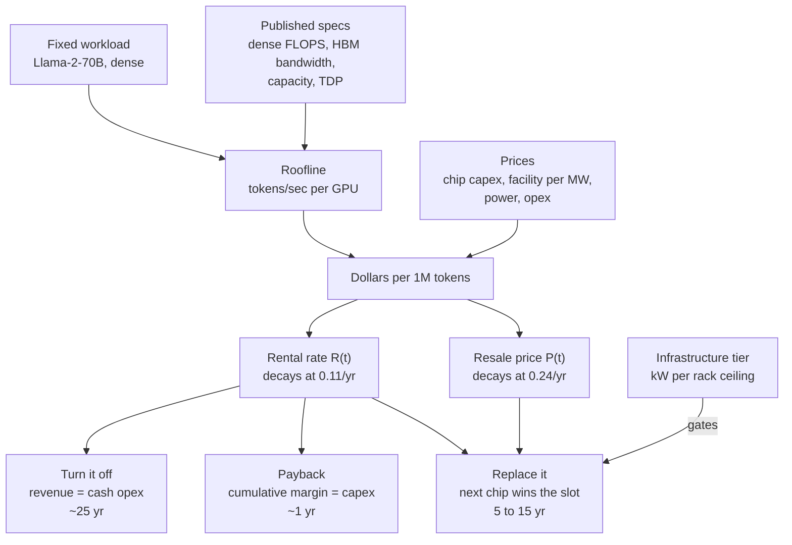

Last time I wrote about [the future value of GPU compute](https://jaredwatkins.com/posts/2026/06/future-value-gpu-compute/) I ended on a hand-wave: economic life is probably 2 to 3 years, the 6-year schedules are optimistic, and the financing layer just moves the problem around. That's a conclusion, not a model. So I built the model.

Six generations of NVIDIA silicon, V100 through B300. One fixed workload, Llama-2-70B, so the chip is the only thing that varies. Everything normalized to dollars per million tokens. Data files and the script are at the bottom; every number below comes out of them.

<!--more-->

## How the pieces connect

Everything downstream hangs off one physical number, tokens per second per GPU, and one market number, what an hour of that GPU rents for.



The three boxes at the bottom are the same asset answering three different questions, and they're the reason nobody agrees on what a GPU is worth.

## Getting tokens per second with incomplete data

MLPerf has published Llama-2-70B inference results for H100, H200, B200 and B300. It has nothing for A100 or V100, because nobody submits a 2020 chip against a 2023 benchmark. So I needed a physical model that reproduces the four measured points and can then be run backward.

Decode on a dense model is three costs stacked: the FLOPs to push a token through, the weights streamed out of HBM once per batch step, and the KV cache re-read per sequence per step. Only the middle one amortizes over batch size.

```
t_token = 2N/F  +  N·b/(BW·B)  +  S·kv/BW
```

The compute roof is the chip's published dense peak, no fudge factor. `N` is 70 billion, `b` is bytes per parameter at whatever precision the chip can actually run, `S` is 1,100 tokens of context, `kv` comes from the model's own architecture (80 layers, 8 KV heads, head_dim 128). That leaves exactly one free parameter, the effective batch `B`, fit against the four measured points.

`B = 104`, and it lands within 7.4% across a 4x range of measured throughput.

| Chip | Precision | TP group | MLPerf tok/s | Model tok/s | Error |
|------|-----------|----------|--------------|-------------|-------|
| V100 SXM2 32GB | FP16 | 8 | n/a | 239 | (derived) |
| A100 SXM4 80GB | INT8 | 2 | n/a | 1,474 | (derived) |
| H100 SXM5 80GB | FP8 | 2 | 3,050 | 2,912 | -4.5% |
| H200 SXM 141GB | FP8 | 1 | 4,358 | 4,023 | -7.7% |
| B200 SXM 192GB | FP4 | 1 | 11,264 | 12,474 | +10.7% |
| B300 SXM 288GB | FP4 | 1 | 13,015 | 13,524 | +3.9% |

One fitted number covering four generations, two memory technologies and three numeric formats is more than I expected. It works because the whole thing is bandwidth-bound, which is also why B300 is barely ahead of B200 here: same 8 TB/s of HBM, 40% more power.

Run it backward and the V100 comes out at 239 tokens a second. It takes eight of them to hold the model at all, 140GB of FP16 weights against 32GB cards, so the smallest thing you can even build is eight GPUs pulling 4 kW at the wall for 1,912 tokens a second. One B300 does 13,015 in one slot on 2.4 kW. Matching a single Blackwell Ultra with 2018 silicon takes 54 V100s and 27 kW, which is two to five racks depending on how good your building was.

## Everything in one unit

| Chip | tok/s | W/slot | kWh/Mtok | Own \$/Mtok | Rent \$/Mtok |
|------|-------|--------|----------|------------|-------------|
| V100 | 239 | 506 | 0.588 | 0.676 | 2.878 |
| A100 | 1,474 | 675 | 0.127 | 0.149 | 0.773 |
| H100 | 3,050 | 1,181 | 0.108 | 0.141 | 0.694 |
| H200 | 4,358 | 1,181 | 0.075 | 0.103 | 0.382 |
| B200 | 11,264 | 1,688 | 0.042 | 0.055 | 0.148 |
| B300 | 13,015 | 2,363 | 0.050 | 0.052 | 0.171 |

These are MLPerf offline units. Production serving under a latency SLO gets maybe 35% of it, so multiply the dollar columns by about 3x for a real API cost. That derate cancels in every ratio, so I left it out of the model.

Energy per million tokens improved 1.35x per year across the whole span. That's independently close to the [roughly 30% annual hardware efficiency gain](https://arxiv.org/html/2511.23455v2) the Price of Progress paper backs into from a completely different direction, which is reassuring. And B300 went backwards: 0.050 kWh/Mtok against B200's 0.042.


That's the only bar in the set that goes down.

Both things are true and only one of them is an excuse. Blackwell Ultra buys 96 more gigabytes of HBM and 40% more power for 16% more tokens here, which is a terrible trade on a dense 70B at 1,100 tokens of context. That memory is for long context and long reasoning traces, and MLPerf's OpenOrca prompts are neither, so yes, this is the wrong benchmark for the chip. The power is not conditional though. It went up by 675 watts a slot whatever you run on it, and the rack has to deliver that from day one.

## Buy versus rent, on the day each chip shipped

| Chip | Own \$/Mtok | Rent \$/Mtok | Rent/own | Breakeven | Months at 85% |
|------|-----------|-------------|----------|-----------|---------------|
| V100 | 0.676 | 2.878 | 4.3x | 6,208 hr | 10.0 |
| A100 | 0.149 | 0.773 | 5.2x | 5,564 hr | 9.0 |
| H100 | 0.141 | 0.694 | 4.9x | 5,766 hr | 9.3 |
| H200 | 0.103 | 0.382 | 3.7x | 7,710 hr | 12.4 |
| B200 | 0.055 | 0.148 | 2.7x | 13,410 hr | 21.6 |
| B300 | 0.052 | 0.171 | 3.3x | 11,718 hr | 18.9 |

Owning has beaten renting by 3 to 5x on day one, every generation, for eight years. The gap is narrowing though: 5.2x on the A100, 2.7x on the B200. Cloud margins are getting compressed by the marketplaces.


Top panel is months of committed use to break even against renting. Bottom is how many times more renting costs. They part company at Hopper and keep going in opposite directions.

Nine months of committed utilization to beat renting an H100. Twenty-two to beat renting a B200. Buy an H100 in March 2023 and you were ahead of the rental market before Christmas. Buy a B200 at launch and the arithmetic doesn't turn until the end of 2026. The number that used to be under a year is now most of two, and it's the one number in this post that has moved steadily in one direction.

## What actually decayed

Rental rates, fit per chip as `R(t) = R0·e^(-λt)`, against the August 2026 market median:

| Chip | λ | Retained/yr | Half-life |
|------|---|-------------|-----------|
| V100 | 0.079 | 92% | 8.8 yr |
| A100 | 0.140 | 87% | 5.0 yr |
| H100 | 0.234 | 79% | 3.0 yr |
| H200 | 0.174 | 84% | 4.0 yr |
| B200 | -0.027 | 103% | never |
| **Pooled** | **0.112** | **89%** | **6.2 yr** |


B200 doesn't have a decline to plot: it rents for more today than it did at launch, and it's eighteen months old.

Today's rate is the median across two aggregators covering 40-odd and 69 providers, which put the H100 at [\$3.37](https://getdeploying.com/gpus/nvidia-h100) and [\$3.38](https://aimultiple.com/gpu-index) an hour in August 2026. They agree to within a third of a percent, which is the only reason I trust either of them, because the cheapest listing on any given day is a third of that.

Which market you price turns out to matter more than which chip. Same six chips, same launch dates, same August 2026:

| Basis | Pooled λ | Half-life |
|-------|----------|-----------|
| Hyperscaler list to hyperscaler list | 0.059 | 11.7 yr |
| Launch rate to market median | 0.112 | 6.2 yr |
| Launch rate to cheapest marketplace listing | 0.244 | 2.8 yr |

Every one of those is defensible and they're a factor of four apart. Take a 2023 hyperscaler quote, divide by a 2026 marketplace clear, and you can print a half-life of 2.8 years without a single chip having done anything. The H100 is the only one here with a real price history rather than two endpoints, and measured inside one basis it decays at 0.099 on hyperscalers, 0.205 on [marketplaces](https://www.silicondata.com/blog/h100-rental-price-over-time), and 0.106 on neoclouds. The spread between those three is competition arriving, not silicon aging.

Which is also why I'm not quoting an R² on the pooled number. It comes out at 0.82 and it looks like a fit, but it's a six-chip cross-section with one launch-to-today ratio each. All it says is that six numbers line up against age. On the H100, the only chip where I can check whether the exponential form holds over time, it doesn't.

The direction has turned, too. GetDeploying's index was up [4.3% over the last twelve months](https://getdeploying.com/gpu-price-index) when I first pulled it, and Silicon Data had the [H200 neocloud index up 14.4%](https://www.silicondata.com/blog/h200-vs-h100-rental-prices-may-july-2026) across twelve weeks that summer. Two weeks later the same GetDeploying page reads 3.2% trailing twelve months and negative 2.8% for the last four weeks alone. Every constant in that first table is an average over a window whose last year runs backwards, and now the window won't hold still either.

Resale is a different shape and this is the part I didn't expect. A100, H100, H200 and B200 all show 89 to 91% annual retention, which looks great until you notice the V100 is the only chip in the set that has completed a full cycle: \$11,458 list in 2018, [\$650 used today](https://gpudojo.com/tesla-v100). That's 71% a year, and it didn't happen smoothly. (A September check of PCIe 80GB listings put used A100s closer to \$18,900, better than double the SXM4 basis this model uses. Could be the form factor, could be the same source problem the rentals had in August. I haven't audited it, so the number above stands until I do.)

Those 90% numbers are all measured on chips that still have somewhere to live. Pull an A100 or an H100 out of a rack today and it goes straight into another rack, because the buildings that host them are everywhere and they aren't full. The V100 is the only chip here that ran out of buildings, and its 71% a year is an average drawn through eight good years and one cliff. The bid held while people were still buying 15 kW racks. Then they stopped, and \$11,458 of silicon became \$650 of silicon. A used GPU is only worth what a building can still plug it into.

## Three different useful lives

"Useful life" is three questions wearing one coat, which is how [Burry's 2 to 3 years](https://www.cnbc.com/2025/11/14/ai-gpu-depreciation-coreweave-nvidia-michael-burry.html) and Meta's 6 years can both get defended.

| Chip | R0 \$/hr | Capex/slot | Turn it off | Payback | Replace it |
|------|---------|-----------|-------------|---------|-----------|
| V100 | 2.48 | \$14,496 | 25.4 yr | 0.9 yr | 14.7 yr |
| A100 | 4.10 | \$21,750 | 27.4 yr | 0.8 yr | 9.9 yr |
| H100 | 7.62 | \$41,812 | 27.1 yr | 0.9 yr | 5.6 yr |
| H200 | 6.00 | \$43,312 | 24.6 yr | 1.2 yr | 5.0 yr |
| B200 | 6.00 | \$73,750 | 22.2 yr | 2.0 yr | 6.2 yr |
| B300 | 8.00 | \$87,250 | 23.9 yr | 1.8 yr | n/a |


Bars are replace-it, the line is payback. B300 is off the chart because nothing had shipped yet that could take its slot, as of August. That's already stale: Vera Rubin is in production now, just without a public MLPerf Llama-2-70B number to run through the same roofline model. The slot has a challenger. It doesn't have a row in this table yet.

Turn-it-off is where the model stops being worth much. Two decades and change is what you get when you take a decay constant fitted over three years and integrate it out to where revenue finally crosses power and opex, and I don't believe a number that far outside the data. Directionally it's the same answer the [T4s still renting at \$0.15/hr](https://intuitionlabs.ai/articles/nvidia-ai-gpu-pricing-guide) eight years on are giving, which is that nobody unplugs a paid-off GPU. Treat it as "longer than you'd think" and move on.

Replace-it is the one that matters, and on these numbers Meta's six years is close to right for Hopper and Blackwell. Burry's two to three doesn't match any column in this table. It matches the 2.8 year half-life you get off the marketplace floor, which is a real number for anyone selling into that market and the wrong one for anyone who owns the rack. CoreWeave's CEO put a number on the other side three weeks after I first ran this: [contracting 2020-vintage GPUs out to 2029](https://247wallst.com/investing/2026/08/12/coreweave-ceo-were-booking-2020-era-nvidia-gpus-through-2029-at-full-freight/), at full price. Nine years on an A100 is not a company talking its book down.

Every chip repaid its capex inside two years, most inside one. What changed is how much came after. The V100 paid itself off in eleven months and then held its slot for fifteen years, sixteen times over. The A100, twelve times over. The H100 six, the H200 four, the B200 three. Payback keeps arriving on schedule and the cushion behind it keeps getting thinner, and the cushion is the part you borrowed against.

## The tier ceiling

The replace-it column has a wrinkle: a challenger can only evict an incumbent if it fits the same building.

| Tier | Years | kW/rack | Cooling | \$/MW | Chips |
|------|-------|---------|---------|------|-------|
| 1 | 2015 to 2020 | 5 to 15 | air + containment | \$6M | V100 |
| 2 | 2020 to 2023 | 15 to 40 | dense air, rear-door HX | \$10M | A100, H100, H200 |
| 3 | 2023 to 2026 | 100 to 140 | direct-to-chip liquid | \$20M | GB200, GB300 NVL72, Vera Rubin NVL144 |
| 4 | 2027 to 2028 | 200 to 600 | DLC at scale | \$28M | Rubin Ultra |
| 5 | 2029+ | 600+ | immersion, or nobody knows | \$35M | ? |


The flat pairs are the tiers. H100 and H200 sit in the same building. B200 and B300 sit in the same building. The steps between them are where the capital goes.

Two chip generations per tier, three at the outside. Inside a tier the next chip is a forklift swap. Across a boundary the incumbent gets a stay of execution, because the challenger has to fund a building before it can beat anything.

A liquid retrofit into a shell that can take it runs [about \$2M per MW against \$11M+ for greenfield](https://stlpartners.com/press/liquid-cooling-retrofits-can-cost-roughly-80-less/). That 5x gap is most of why Hopper kept earning through 2025 while Blackwell was already shipping.

Rubin Ultra wants 600 kW in a single rack, which is what forty tier-1 racks pulled between them. At that density, breaker capacity and floor loading are still open engineering problems, not something a better cold plate fixes. Tier 5 in that table is priced at \$35M per MW with the cooling column left blank, because nobody has built the cooling for it yet. Everything past tier 4 here is a trend line into a building that doesn't exist.

The standard Vera Rubin chip is a different story, and it's the one that actually matters for the table above. NVL144 draws [120 to 130 kW a rack](https://introl.com/blog/nvidia-vera-rubin-gpu-600kw-racks-2027), which is tier 3, the same building B300 already lives in. Nvidia's fiscal Q2 earnings call on August 26 had it "ramping into full production" at CoreWeave, Google Cloud, Azure, Oracle and Nebius, not a roadmap slide. The boundary that was supposed to buy B300 a stay of execution isn't there this time. Whatever replaces it doesn't need a new building.

## The formula

```
V(t) = ∫[t..T*] ( R₀·e^(-λr·s) − C_power − C_opex ) ds  +  P₀·e^(-λp·T*)

  λr = 0.11/yr   rental revenue decay      (market-median basis;
                 0.06 to 0.25 depending on the market you price)
  λp = 0.24/yr   resale value decay        (fit, R² = 0.82, unaudited)
  T*             set by replacement, gated by the infrastructure tier
```

The two decay rates don't match, and that gap is the whole result: the slot keeps earning at 0.11 and keeps its price at 0.24. Of the two I'd trust the revenue side. The resale fit is four chips that have never been resold and one that has.

| Basis | Yr 1 | Yr 2 | Yr 3 | Yr 4 | Yr 5 | Yr 6 |
|-------|------|------|------|------|------|------|
| Fitted revenue | 89% | 80% | 71% | 64% | 57% | 51% |
| Fitted resale | 78% | 61% | 48% | 38% | 30% | 23% |
| Straight-line 4yr | 75% | 50% | 25% | 0% | 0% | 0% |
| Straight-line 6yr | 83% | 67% | 50% | 33% | 17% | 0% |


So the six-year schedule is the conservative one. On revenue the fitted curve sits above it at every year and above straight-line-4 by a wide margin, which means an operator depreciating an H100 over six years has been writing it down faster than the rental market has.

The gap worth looking at is between the two fitted curves. In year six the slot is still earning like half an asset and would sell like a quarter of one. Same chip, same day, 28 points apart.

I went in looking for the two to three year economic life and a set of accounting schedules that flattered the people writing them. The arithmetic doesn't support either. Price the rentals against the market instead of against the floor and the silicon looks durable, the six-year schedule looks careful, and the argument everyone is having about depreciation policy turns out to be an argument about which quote you started from.

Which leaves the part I can't explain. In year six the slot still earns like it's worth half of what it cost, and the used market prices it at a quarter. One of those numbers is wrong, and starting October 5 there's a way to bet real money on which one: [CME is listing futures](https://www.cmegroup.com/media-room/press-releases/2026/8/11/cme_group_and_silicondatatolaunchcomputefuturesonoctober5tounloc.html) on the Silicon Data H100 and B200 rental indices. Someone's about to find out.

---

Data files and the scripts are in this post's directory: `data/*.csv`, `model.py`, and `make_charts.py`. Run `python3 model.py` and every table above regenerates; run `python3 make_charts.py` and every chart does too, straight off the same numbers. Argue with the assumptions at the top of `model.py`, they're all knobs.
