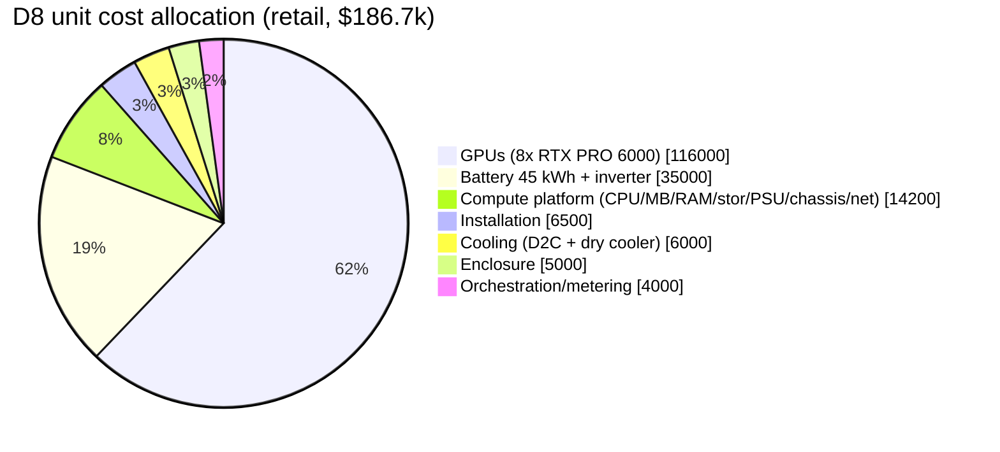
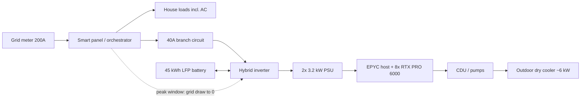

> **⚠ Disclaimer:** This entry may be incomplete, out of date, or inaccurate. It is AI-maintained on a best-effort basis. Do not rely on it as a sole source — verify claims independently using the sources listed below.

> **Note on entry type:** This is a working engineering/cost model, not a company profile. Unless a figure is tied to a cited source, every number below is a **planning estimate** intended for scenario comparison, not a quote. Component prices move quickly (the anchor GPU rose 55% in 16 months).

## Summary

This model tests what can be built today, with purchasable hardware, to replicate [Span]()'s XFRA offering: a self-contained, liquid-cooled AI inference unit deployed at Texas homes, sharing the home's standard 200A electrical service without overload risk during summer air-conditioning peaks. The design point that emerges is an 8-GPU RTX PRO 6000 Blackwell Server Edition unit drawing ~6.1 kW at the wall on a 40A/240V branch circuit, buffered by a 45 kWh battery (40–50 kWh class), at an estimated build-plus-install cost of **~$187k retail / ~$136k at fleet volume**, hosting models up to ~405B parameters at FP8 and producing tokens at an estimated **$0.26–0.38 per million** at ideal utilization.

## 1. Power Envelope: What a Texas Home Can Spare

A 200A/240V service is 48 kW nominal; NEC continuous-load rules (80%) cap sustained draw at **38.4 kW**. The compute unit is a continuous load, so it must fit inside the gap between that ceiling and the home's own summer peak — with margin, because summer peaks in Texas are AC-driven and coincident across the neighborhood.

Average monthly usage by home size ([Choose Texas Power](https://www.choosetexaspower.org/energy-resources/average-electricity-usage/), 2020–2024 marketplace data; peak-kW column is a derived estimate):

| Home size | Summer monthly kWh (est.) | Est. summer peak demand | Headroom vs. 38.4 kW ceiling (25% margin on peak) | Qualifies for |
|---|---|---|---|---|
| <1,500 sq ft | ~1,100–1,400 | ~6 kW | ~30.9 kW | Any unit size |
| 1,500–2,500 sq ft | ~1,400–2,000 | ~9 kW | ~27.2 kW | Any unit size |
| 2,500–3,500 sq ft | ~2,200–2,600 | ~12 kW | ~23.4 kW | Any unit size |
| >3,500 sq ft, all-electric | ~2,800+ | ~16 kW | ~18.4 kW | D4/D6 only (see §7 caveat) |

**The optimal host is not the biggest house.** It is a small-to-mid, newer, well-insulated home with gas heat/appliances, no EV charger (or a managed one), and 200A service — maximum service capacity relative to its own load. The practical qualification gate is not measured demand but the **NEC 220.83 calculated load** the permitting authority applies: large all-electric homes with EV chargers can calculate to 150A+, leaving too little calculated headroom for a 40A continuous branch circuit even though measured headroom exists. Assume a meaningful fraction of homes (plausibly 30–50%, unverified estimate) fail qualification on calculated load, panel condition, or siting.

## 2. GPU Options

Datacenter-class PCIe cards compared (specs from [NVIDIA](https://www.nvidia.com/en-us/data-center/rtx-pro-6000-blackwell-server-edition/) for RTX PRO 6000 SE; others are search-derived estimates):

| GPU | TDP | Memory | FP8 dense | Street price (est.) | $/GB VRAM | Notes |
|---|---|---|---|---|---|---|
| **RTX PRO 6000 Blackwell SE** | 600W (config.) | 96 GB GDDR7, 1.6 TB/s | ~1 PFLOPS (2 PFLOPS w/ sparsity) | ~$13,250–15,000 | ~$150 | Span's actual XFRA silicon; liquid SKU is **single-slot** |
| H200 NVL | 450–600W (config.) | 141 GB HBM3e, 4.8 TB/s | ~1.67 PFLOPS dense | ~$30,000–35,000 | ~$230 | 3× memory bandwidth; NVLink bridge 2–4 way |
| H100 NVL | 400W | 94 GB HBM3, 3.9 TB/s | ~1.6 PFLOPS w/ sparsity | ~$25,000–30,000 | ~$290 | Prior gen; poor value vs. H200 NVL now |
| L40S | 350W | 48 GB GDDR6, 864 GB/s | ~0.7 PFLOPS w/ sparsity | ~$7,000–8,000 | ~$155 | More cards per kW but small VRAM fragments models |

**Selection: RTX PRO 6000 Blackwell SE.** Best $/GB and $/FP8-FLOP of the set, matches Span's own choice, and the liquid-cooled variant's single-slot FHXL form factor is what makes an 8-GPU board layout physically possible. H200 NVL is the upgrade path when the workload is large-model, long-context inference where HBM bandwidth dominates (a 4× H200 NVL variant is costed below). H100 NVL is dominated by H200 NVL at similar power. L40S maximizes card count per kW but 48 GB fragments large models across too many PCIe hops.

## 3. Unit Configurations

Wall draw = (GPUs + CPU + platform + pumps) / 94% PSU efficiency + dry-cooler fans. Breaker sized so continuous draw ≤ 80% of rating.

| Config | GPUs | Total VRAM | IT load | Wall draw | Branch circuit | 45 kWh battery ride-through |
|---|---|---|---|---|---|---|
| D4 | 4× RTX PRO 6000 | 384 GB | 2.9 kW | ~3.3 kW | 20A @ 240V | ~13.5 h |
| D6 | 6× RTX PRO 6000 | 576 GB | 4.1 kW | ~4.7 kW | 25–30A @ 240V | ~9.7 h |
| **D8 (design point)** | 8× RTX PRO 6000 | 768 GB | 5.4 kW | ~6.1 kW | 40A @ 240V | ~7.3 h |
| H4 | 4× H200 NVL | 564 GB | 2.9 kW | ~3.3 kW | 20A @ 240V | ~13.5 h |

**Battery-buffered power strategy.** The unit runs at constant wall draw off-peak. During the ERCOT summer peak window (~3–7 p.m.), the orchestrator drops grid draw to zero and runs the unit from the battery — the home keeps its full 200A service exactly when the AC needs it, and the compute never throttles. The standard pack is **45 kWh (40–50 kWh class)** across all configs: a Powerwall 3 + three expansions (13.5 kWh modules, ~$998/kWh installed per EnergySage 2026 data) or a ~45 kWh EG4-class LFP stack (~$600–800/kWh installed). That covers the full 4-hour peak window for every config with margin (7.3h ride-through even on D8), leaves surplus capacity for arbitrage/ancillary services, and doubles as a UPS. §8 examines adding rooftop solar on top of this storage.

## 4. Cooling

D8 rejects ~5.4 kW of heat continuously into 40–45°C Texas summer ambient.

| Approach | Est. CAPEX (D8) | Pros | Cons |
|---|---|---|---|
| **Direct-to-chip loop (selected)** | ~$6,000 retail | Liquid SE cards ship cold-plated; 3–5× cheaper than immersion; serviceable; 30–45°C coolant tolerates 45°C ambient with a properly sized dry cooler | Fittings/leak points; pump is a single point of failure (dual pumps specified) |
| Single-phase immersion | ~$14,000 retail | Sealed, silent, dust/vandal/weather tolerant — attractive for an unattended outdoor pad | Dielectric fluid is a major line item (hundreds of $/gal); heavy (pad load); messy service; still needs an external heat rejection loop |

Direct-to-chip wins on cost and serviceability for a fleet product; immersion is worth revisiting if field failure data shows enclosure ingress or acoustic complaints dominate. Heat rejection is a ~6 kW dry cooler (roughly a 2-ton condenser footprint) at ~15°C approach; fan noise at property lines (~50 dBA class) is a deployment constraint to verify against local ordinance.

## 5. Platform: Motherboard, CPU, Memory

The liquid-cooled single-slot cards allow all eight GPUs on one board without PLX switches:

- **Motherboard:** ASRock Rack **GENOAD8X-2T** (SP5, 7× PCIe 5.0 x16) — seven slots direct; the eighth GPU rides a x16 riser off an MCIO port, or step up to a Supermicro H13/H14 GPU server board. Single-socket EPYC provides 128 PCIe 5.0 lanes — the reason EPYC owns this niche.
- **CPU:** AMD EPYC 9354P (32C, 280W) — inference hosts are GPU-bound; cores mostly feed tokenization, batching, and network.
- **System memory:** **768 GB DDR5 RDIMM (12× 64 GB)** — sized 1:1 with aggregate VRAM so any hosted model can be staged/hot-swapped from RAM; 1.5× (1.15 TB) if model-swap agility matters more than cost.
- **Storage:** 2× 7.68 TB NVMe U.2 (model library + OS, RAID1).
- **PSU:** 2× 3.2 kW titanium CRPS, redundant; 240V input.

## 6. Cost Model (D8 design point)

Retail = buy-it-today street pricing; Volume = estimated fleet pricing (~25% off, unverified estimate). GPU price anchored to [NVIDIA marketplace/Newegg listings via Tom's Hardware](https://www.tomshardware.com/pc-components/gpus/nvidia-raises-rtx-pro-6000-blackwell-gpu-pricing-to-usd13-250-55-percent-increase-over-msrp-in-a-years-time); all other line items are planning estimates.

| Line item | Retail | % | Volume | % |
|---|---|---|---|---|
| 8× RTX PRO 6000 Blackwell SE (liquid) | $116,000 | 62.1% | $88,000 | 64.8% |
| Battery: 45 kWh LFP + hybrid inverter | $35,000 | 18.7% | $22,500 | 16.6% |
| Installation (pad, 40A subpanel, permits, labor, commissioning) | $6,500 | 3.5% | $4,500 | 3.3% |
| Cooling: D2C loop, CDU, manifolds, dry cooler | $6,000 | 3.2% | $4,200 | 3.1% |
| Vandal-resistant pad-mount enclosure (NEMA 3R, steel, locked, alarmed) | $5,000 | 2.7% | $3,200 | 2.4% |
| RAM: 768 GB DDR5 RDIMM | $4,600 | 2.5% | $3,400 | 2.5% |
| Orchestration: smart panel / CT metering / remote mgmt controller | $4,000 | 2.1% | $2,800 | 2.1% |
| CPU: EPYC 9354P | $2,800 | 1.5% | $2,100 | 1.5% |
| PSUs: 2× 3.2 kW titanium | $1,800 | 1.0% | $1,300 | 1.0% |
| Storage: 2× 7.68 TB NVMe | $1,700 | 0.9% | $1,300 | 1.0% |
| Motherboard: GENOAD8X-2T | $1,400 | 0.7% | $1,050 | 0.8% |
| Chassis, risers, cabling | $1,200 | 0.6% | $900 | 0.7% |
| Networking: 25GbE NIC, router, fiber CPE | $700 | 0.4% | $500 | 0.4% |
| **Total** | **$186,700** | 100% | **$135,750** | 100% |

**Justification of the allocation.** GPUs are ~62–65% of the build regardless of pricing tier, which is why the GPU choice (§2) dominates every other engineering decision — a 10% GPU discount is worth more than eliminating the enclosure entirely. The 45 kWh battery is the second-largest item at ~17–19% and is the price of the "never threatens the AC" guarantee plus surplus capacity for arbitrage; a curtailment-only (Span-style orchestrated throttling) variant deletes $35k/$22.5k but reintroduces throttling during exactly the hours ERCOT prices and grid stress peak. Everything else — the entire computer around the GPUs — is under 10% of the system.

**Installation and enclosure.** Texas electrician rates run ~$85–125/hr; a subpanel install is typically $500–1,750 before trenching, so the $6,500 retail line assumes: concrete pad, 40A/240V branch circuit with disconnect, permit and inspection, crane-less two-person set, and commissioning. The enclosure is a pad-mounted steel telecom-style cabinet (NEMA 3R minimum, 4X if coastal), three-point locking, tamper/tilt alarm, and a fenced or anchored footprint — the same class of hardware utilities use for pad transformers, which have survived decades of public siting.

## 7. What It Can Host (FP8/INT8) and Token Economics

768 GB of aggregate VRAM on the D8, FP8 ≈ 1 byte/param:

| Model | Precision | Weights | GPUs used | Fits? | Serving layout |
|---|---|---|---|---|---|
| Llama 3.3 70B | FP8 | ~70 GB | 1 (tight) or 2 | Yes | 4× two-GPU replicas — the workhorse config |
| GPT-OSS 120B | MXFP4/INT8 | ~65–120 GB | 2 | Yes | 4 replicas |
| Qwen3 235B (MoE) | FP8 | ~235 GB | 4 | Yes | 2 replicas |
| Llama 3.1 405B | FP8 | ~405 GB | 8 (TP8) | Yes, ~360 GB KV headroom | 1 instance |
| DeepSeek-R1 671B | FP8/INT8 | ~671 GB | 8 | Marginal (~97 GB KV — short context only) | 1 instance |
| DeepSeek-R1 671B | INT4 | ~336 GB | 6–8 | Yes | 1 instance, comfortable |

**Token cost at ideal use.** Assumptions: 70B-class FP8 serving at high concurrency, ~5,000 aggregate tok/s across 4 replicas (extrapolated from published single-card Pro 6000 vLLM results of ~5,200–9,000 tok/s on 8–14B models and single-card 70B FP8 viability; unverified estimate), 90% utilization → **~389M tokens/day**. Energy: 147 kWh/day at $0.135/kWh ≈ $20/day. Volume CAPEX $135,750 amortized straight-line, $5/day maintenance/network allowance:

| Amortization | CAPEX/day | All-in cost per 1M tokens |
|---|---|---|
| 3 years | $124 | **~$0.38** |
| 4 years | $93 | **~$0.30** |
| 5 years | $74 | **~$0.26** |

Energy alone is only ~$0.05/M tokens — this is a CAPEX-dominated business, which is the economic logic of Span's subsidize-the-panel model.

**Utilization sensitivity.** Because ~85% of daily cost is fixed CAPEX, cost per token is nearly inversely proportional to utilization. Modeling wall draw as ~1.5 kW idle + load-proportional to 6.1 kW full (so energy falls somewhat at low duty), D8 volume build:

| Utilization | Energy/day | Tokens/day | $/M tokens (3yr) | $/M tokens (5yr) | Daily cost (3yr) |
|---|---|---|---|---|---|
| 40% | 80 kWh ($10.9) | 173M | $0.81 | $0.52 | ~$140 |
| **60%** | 103 kWh ($13.9) | 259M | **$0.55** | **$0.36** | ~$143 |
| **80%** | 125 kWh ($16.9) | 346M | **$0.42** | **$0.28** | ~$146 |
| 90% (ideal) | 136 kWh ($18.4) | 389M | $0.38 | $0.25 | ~$147 |

Note the daily cost column barely moves (~$140–147) while output doubles — idle hardware costs almost as much as busy hardware. Against mid-2026 API pricing for 70B-class open models (roughly $0.60–0.90/M output tokens, unverified estimate): at 80% the unit clears a healthy margin, at 60% it still clears the low end of market pricing, and the **3-year breakeven sits at ~55% utilization** at a $0.60/M market price. On 5-year amortization even 60% utilization is comfortably economic. **Utilization, not hardware, is the whole game** — consistent with the subsection steering's warning that consumer-earnings claims in this space rest on utilization assumptions, not observed data — and it is why the monetization stack in §11 is designed around backfilling idle capacity.

## 8. Solar-Augmented Options: 12 kW PV on the 45 kWh Base

Texas residential solar systems now average ~12 kW DC (largest in the US, driven by AC loads) at an installed cost of roughly **$2.20–2.85/W** in 2026; Texas yield is ~1,450–1,600 kWh/kW/yr (search-derived estimates; see Sources). Against the D8's 147 kWh/day appetite, a 12 kW array delivers ~49 kWh/day annual average and ~62 kWh/day in summer — **~32% annual / ~40% summer coverage** at 95% self-consumption (achievable because the standard 45 kWh battery absorbs essentially all midday surplus).

Scenario comparison, D8 design point (retail / volume; solar at $2.75/$2.00 per watt):

| Scenario | Added CAPEX (retail / volume) | Total (retail / volume) | Net grid energy | $/M tokens (3yr / 4yr / 5yr, volume) |
|---|---|---|---|---|
| **A** — baseline: 45 kWh battery, grid-only (§6) | — | $186.7k / $135.8k | 147 kWh/day | $0.38 / $0.30 / $0.26 |
| **B** — + 12 kW solar | +$33.0k / +$24.0k | $219.7k / $159.8k | ~100 kWh/day | $0.42 / $0.33 / $0.27 |
| **C** — as B, fleet-owned with ~30% ITC + MACRS (~45% net reduction on PV+storage, unverified estimate) | — | net ~$138.8k volume | ~100 kWh/day | $0.37 / $0.29 / $0.24 |

**The headline result is negative on pure token economics: solar does not pay for itself inside this model.** At $0.135/kWh, 12 kW of PV saves only ~$6.6/day of energy while adding ~$24–33k of CAPEX — and this is a CAPEX-dominated system (§7). Homeowner-priced solar (scenario B) makes tokens ~7–10% *more* expensive; only fleet-owned solar capturing the commercial 48E ITC and MACRS depreciation (scenario C) gets slightly below the grid-only baseline. Solar is not an energy-cost play here.

What the solar-augmented configuration actually buys:

- **Summer grid-zero operation.** Solar (62 kWh) + 45 kWh of storage lets the D8 run **grid-zero for ~17 of 24 hours** on a summer day — the unit disappears from the feeder during the entire stressed period, the strongest possible answer to the utility/AHJ overload objection and a qualification unlock for homes that fail the §1 calculated-load screen.
- **A near-off-grid D4.** The 4-GPU unit needs only ~80 kWh/day; 12 kW PV + 50 kWh storage covers ~77% of summer load and ~61% annually, with grid draw only in overnight tails. A D4 at a solar home adds almost no net annual load — the "infinite headroom" qualification case.
- **Price-spike hedge and islanding.** Retail energy exposure drops ~⅓; during Uri-class events the unit islands with the home rather than competing with it — the battery + inverter become a whole-home resilience asset that is part of the homeowner compensation story.
- **ERCOT arbitrage/ancillary capacity.** 45–50 kWh with only ~25 kWh committed to peak ride-through leaves ~20+ kWh/day for price arbitrage or ancillary services (unmodeled revenue; on volatile ERCOT days plausibly rivals the token-cost delta between scenarios A and B).
- **New-construction synergy.** On a Pulte-style build (Span's actual channel), solar, storage, smart panel, and interconnection agreement are installed once, together — the marginal orchestration and install lines in §6 shrink, and scenario C's tax treatment applies by default since the fleet owns the equipment.

**Verdict:** grid-only (A) remains the cost-per-token floor for retrofit deployments; solar-augmented (C) is the fleet configuration for new construction and for homes that can't otherwise qualify — bought for headroom, resilience, and grid-relations value rather than for the energy savings.

## 9. Secondary-Market GPU Options

The 2026 refresh cycle (hyperscalers moving to Blackwell/B300) is pushing large volumes of Ampere and early Hopper hardware onto the secondary market. Since DisCo's target workload is inference only, used datacenter GPUs are worth modeling. Street pricing (search-derived from [Hashrate Index](https://hashrateindex.com/blog/used-gpu-market-pricing-deprecation-secondary-ai/) and broker listings; wide bands, treat as indicative):

| Used part | Typical 2026 price | Memory | Inference-relevant limits |
|---|---|---|---|
| A100 80GB PCIe | ~$4,000–7,000 | 80 GB HBM2e, 2.0 TB/s | **No FP8** (Ampere): INT8/BF16 only; 300W |
| A100 80GB SXM4 (module) | ~$5,000–9,000 | 80 GB HBM2e | Requires HGX baseboard + host; 400W |
| H100 SXM5 (module) | ~$6,000–15,000 | 80 GB HBM3, 3.35 TB/s | FP8 yes; requires HGX baseboard; 700W |
| Complete used H100 HGX server | ~$150,000–180,000 | 640 GB | Turnkey but oversized pricing vs. parting out |

**NVLink supporting equipment — counted in all three budgets.** PCIe A100s interconnect only in bridged pairs (3× NVLink bridges per pair, ~$1,500 for four pairs; no switch involved, cross-pair traffic falls back to PCIe). SXM modules require an **HGX baseboard whose 6 (A100) or 4 (H100) integrated NVSwitch chips are part of the deal**: they add ~400–500W of continuous draw to the power budget, their heat lands in the same liquid loop (cold-plate kits must cover the switch ASICs, +~$3,000–3,500 retrofit line), and the baseboard itself is a ~$10,000–15,000 used line item when parting out modules. External NVLink Switch appliances are multi-node equipment and are *not* required at single-unit scale — no rack switch line item beyond ordinary Ethernet.

Configurations on the same platform/enclosure base as §6, all with the standard 45 kWh battery (non-GPU base: $70.7k retail / $47.8k volume):

| Config | GPUs + fabric | Wall draw / breaker | Heat to loop | 45 kWh ride-through | Total (retail / volume) | Est. 70B-class throughput | $/M tok (3yr / 5yr, volume) |
|---|---|---|---|---|---|---|---|
| D8 (new, ref.) | 8× RTX PRO 6000 | 6.1 kW / 40A | 5.4 kW | ~7.3 h | $186.7k / $135.8k | ~5,000 tok/s | **$0.38 / $0.26** |
| U8P | 8× used A100 PCIe + bridges | 3.4 kW / 20A | 3.0 kW | ~13.2 h | $124.2k / $93.3k | ~2,000 tok/s (INT8) | $0.65 / $0.43 |
| U8S | used HGX A100 8× SXM4 (incl. 6× NVSwitch) | 4.9 kW / 30A | 4.3 kW | ~9.2 h | $136.2k / $100.8k | ~2,400 tok/s (INT8) | $0.60 / $0.41 |
| UH8 | used HGX H100 8× SXM5 (incl. 4× NVSwitch), $10k modules | 7.7 kW / 50A | 6.8 kW | ~5.8 h | $185.2k / $142.8k | ~4,200 tok/s (FP8) | $0.49 / $0.33 |
| UH8-low | same, $6k modules (bottom of range) | 7.7 kW / 50A | 6.8 kW | ~5.8 h | $153.2k / $110.8k | ~4,200 tok/s (FP8) | **$0.40 / $0.28** |

Throughput figures are unverified planning estimates scaled from the §7 baseline (H100 ≈ 0.85× Pro 6000 per card on FP8 serving; A100 ≈ 0.4× — Ampere pays twice, running INT8/BF16 without a transformer-engine FP8 path and with half the compute per watt).

**Verdict: cheap capacity, not cheap tokens — with one exception.** Used Ampere looks tempting on sticker but loses ~60–70% on $/M tokens against new Blackwell: token cost is driven by throughput per dollar *and per watt*, and a 2020 architecture without FP8 trails on both. Where used A100s do win decisively is **$/GB of VRAM** (~$71–83/GB vs. ~$115/GB volume for the Pro 6000) — the right tool if the business is hosting many long-tail models warm, batch/offline inference, or capacity resale where utilization (not throughput) is the product. Used H100 HGX is the genuine opportunity: at the bottom of the current module price band (~$6k) it comes within ~5–8% of the new-Blackwell token cost, keeps FP8 and a full 900 GB/s all-to-all NVSwitch fabric (better 405B-class TP8 serving than the PCIe-attached D8), at the price of a 50A circuit, ~25% more heat rejection, and a shorter (~5.8h) ride-through on the standard 45 kWh battery. Fleet risks unique to secondary sourcing: no warranty (self-insure ~2–4% annual failure allowance), provenance/firmware verification, HBM wear from training duty, and air-to-liquid retrofit labor at scale — none modeled above.

## 10. Waste-Heat Recovery: Hot Water, Space Heating, Dehumidification, and Water Generation

The D8 rejects ~5.4 kW continuously — **~130 kWh of thermal energy per day** already collected in a liquid loop at 45–55°C. That temperature is the key asset: it is directly usable, and there is commercial precedent — Qarnot (France) has sold compute-as-boiler since 2015 with water exiting at 65°C and ~95% heat capture; Heata (UK) mounts compute nodes on domestic hot water cylinders, saving households ~£250/yr; Deep Green heats swimming pools; UK Power Networks piloted residential compute-as-heating in 2025; and the EU's EnEfG requires new datacenters to utilize waste heat from 2026 (search-derived; see Sources).

**Path 1 — Domestic hot water (works everywhere, including Texas).** A double-wall brazed-plate heat exchanger (potable-water code requirement) tees the GPU return loop into a preheat tank ahead of the existing water heater; a 3-way diverting valve sends unneeded heat onward to the dry cooler. A typical household draws only ~12–15 kWh(th)/day for hot water, so DHW absorbs barely **10%** of the unit's output — but it does so year-round, displaces ~$1.60–2.00/day of resistance water heating (~$600–700/yr), and the hardware adder is small: ~$2,000–3,500 retail for HX, valve, pump, and controls. On the homeowner-compensation ledger, "your water heating is free" is a concrete, legible benefit that costs the fleet almost nothing.

**Path 2 — Hydronic space heating (the cold-climate variant).** 5.4 kW is ~18,400 BTU/hr of continuous output — roughly a third to half of the design-day heating load of a well-insulated 2,000–2,500 sq ft home in a cold climate, and essentially all of its shoulder-season load. The 45–55°C loop matches low-temperature hydronic emitters directly (radiant floor at 35–45°C supply, modern panel radiators); legacy high-temp baseboard needs a small water-to-water heat pump boost (COP 5+ for a 45→65°C lift). Integration is a buffer tank plus either radiant loops or a hydronic air-handler coil. In a ~6,500 HDD climate the unit displaces an estimated 20–25 MWh(th)/yr — worth ~$2,700–3,400/yr against resistance heat or ~$800–1,200/yr against gas (unverified estimates). Cold climates also improve the cooling side: the dry cooler runs far below Texas design ambients, and winter grid peaks (heating-driven) complement the battery strategy.

**Path 3 — Desiccant dehumidification (the Texas-summer path).** In humid Texas (Houston, Gulf Coast, much of the Triangle), a large share of summer AC energy — commonly estimated at roughly a third of the load (unverified estimate) — goes to removing moisture (latent load), not lowering temperature. Desiccants strip that moisture directly, and the heat required to regenerate the desiccant is exactly what DisCo has in surplus. The temperature match is real and current: [Mojave Energy Systems]()' AquaDry (launched May 12, 2026; shipments late 2026) is a hydronic liquid-desiccant air handler explicitly designed to regenerate from **110–180°F (43–82°C) low-grade hot water** and marketed as waste-heat-compatible, with data centers named among target facilities — the DisCo loop's 45–55°C sits at the usable bottom of that band (hotter-loop operation improves regeneration margin). Supporting ecosystem: Mojave's ArctiDry DOAS claims 40–60% energy reduction and is in a DoD SERDP/ESTCP demonstration (see the [Mojave Energy Systems]() entry for full detail); [Blue Frontier]() packages a related thermally-regenerated liquid-desiccant AC with built-in brine energy storage, though — unlike Mojave — with no disclosed data-center application as of this review; academic work puts optimal LiCl regeneration near [65°C](https://www.sciencedirect.com/science/article/abs/pii/S0140700719301367). Solid desiccant wheels typically want 60–120°C regeneration air — marginal for this loop; **liquid desiccant is the match**.

Indicative cost to bolt onto a DisCo host home (planning estimates — no residential-scale hydronic LD product exists yet; figures assume adapting the smallest commercial units or a purpose-built fleet module):

| Line item | Est. retail | Notes |
|---|---|---|
| Liquid-desiccant dehumidification air handler (smallest commercial class, ~300–500 CFM) | $8,000–15,000 | Commercial LD-DOAS units are 1,000+ CFM; residential scale would need a fleet-developed module |
| Hydronic tie-in: double-wall HX, pumps, 3-way valves | $1,500–2,500 | Shares the §10 Path-1 manifold |
| Ducting into home return plenum + controls integration | $2,000–4,000 | Ties to home thermostat/HVAC |
| **Total (retrofit)** | **~$12,000–21,000** | vs. ~$2,000–4,500 for a conventional 500–700W whole-house dehumidifier |

Operational concerns: LiCl/CaCl₂ solutions are chloride-corrosive (titanium or polymer heat exchangers, no carbon steel anywhere in the wetted path); desiccant carryover into supply air must be controlled (droplet eliminators); crystallization at high concentration if regeneration overruns; annual desiccant top-off; and the airflow integration means HVAC-contractor service calls, not IT service calls. The honest economics: displaced latent work is only ~1.5–2.5 kWh(e)/day of compressor energy (~$0.20–0.35/day, summer only), so a retrofit never pays back on energy. The value is **peak coincidence**: removing latent load cuts the home's 4–7 p.m. AC draw by an estimated 0.5–1 kW exactly when the §1 headroom calculation binds — it buys qualification margin and feeder relief, which is fleet value, not homeowner savings. Plausible only as a fleet-developed module at new-construction scale.

**Path 4 — Atmospheric water generation (the on-brand speculative path).** The same liquid-desiccant chemistry pointed at water production instead of dry air. The directly relevant player is [Uravu Labs](), whose liquid desiccant regenerates at **35–60°C** — the DisCo loop is entirely inside that window — and whose Clausius platform claims up to 30,000 L of water per MW of IT load per day for datacenter deployments (company claim, unverified; see that entry's Claim Verification). Scaled naively to the D8's 5.4 kW of IT load, that is **~160 L/day**; a generic sorbent-energy estimate of 0.5–1.2 kWh(th)/L applied to the 130 kWh(th)/day stream gives a consistent ~110–260 L/day range (unverified estimates). MOF-based sorbents ([MOF-801](), regenerable on a ~40°C swing; [Atoco]() commercially) are the other chemistry in-window.

Market benchmarks for what water-from-air costs today: [Watergen's Genny](https://watergen.com/product-page-gen-l/) (condensation-type, ~30 L/day residential) runs ~[250 Wh(e)/L, $0.07–0.15/L](https://cleantechnica.com/2019/02/14/watergens-atmospheric-water-generators-pull-water-from-thin-air/); [Aquaria Hydropack-class whole-home units](https://www.aquaria.world/blog-posts/atmospheric-water-generator-cost-tco-breakdown) run 245–288 Wh(e)/L; [SOURCE hydropanels](https://energybs.com/green-living/water/atmospheric-water-generator-awg-hydropanel-guide/) (solar-sorbent) cost ~$2,500–3,000/panel installed for 3–5 L/day. A DisCo-attached sorbent stage has no per-liter energy cost at all — the heat is free — but there is **no off-the-shelf waste-heat-driven residential AWG**; a fleet prototype (desiccant contactor, regenerator, condenser coil, filtration) is plausibly $10,000–20,000 (unverified estimate) against municipal water worth **$0.001–0.004/L** — i.e., ~160 L/day is worth cents. Potable use adds NSF/ANSI-class filtration, UV, mineralization, and biological-growth management in stored water.

The engineering case that survives: **close the cooling loop with the water.** Adiabatic (evaporative-assist) dry coolers are standard practice and transform hot-day performance; fully evaporating the D8's 5.4 kW for the six worst hours needs only ~48 L (0.68 kWh(th)/L latent heat), and spray-assist typically needs far less. The unit's own ~110–260 L/day sorbent output more than covers it — meaning **the heat makes the water that rejects the heat**: a smaller, quieter dry cooler that holds capacity at 45°C ambient with zero municipal water hookup, sidestepping both the noise-ordinance and the water-utility conversation. That, not drinking water, is the credible DisCo application — and it is the same argument Uravu is making at datacenter scale.

**What it means for the model.** As a token-cost credit the effect is modest — even full winter displacement is worth only ~$0.01–0.02/M tokens on the D8, a 3–8% improvement on the 3-year figure — so heat recovery does not change the §6/§7 conclusions. Its real value is strategic: in Texas the DHW tap is a cheap homeowner-retention feature, summer heat is best spent on latent-load relief and adiabatic-assist water (Paths 3–4) rather than dumped, and in cold climates the calculus inverts enough to define a distinct **DisCo-North variant**: heat becomes a second product with an existing commercial playbook, the qualification problem eases (winter-peaking feeders, no AC-coincidence constraint), and new-construction integration (the PulteGroup pattern) can plumb the buffer tank and radiant loops at build time for near-zero marginal cost. The main engineering deltas for DisCo-North: glycol concentration for freeze protection, snow/ice-rated enclosure and dry cooler, and heat-priority (rather than dump-priority) loop controls.

## 11. Monetizing the Network: Revenue Stacks, Software, and Marketplace Integration

A fleet of DisCo units is a portfolio of three sellable things — compute, flexibility, and byproducts — and the §7 utilization math says the business lives or dies on stacking them so no hour goes unsold.

**Tier 1 — Contracted inference capacity (the anchor, 40–60% of hours).** Span's own XFRA model: multi-year capacity contracts with hyperscalers/"neoscalers" who treat the fleet as a distributed availability zone for latency-tolerant inference and cloud gaming. This is the only tier that supports fleet financing, because it is the only one with predictable revenue. Pricing reference: dedicated RTX PRO 6000 capacity rents for ~$1.69–3.00/GPU-hr at managed providers ([RunPod](https://www.runpod.io/gpu-models/rtx-pro-6000), [Northflank](https://northflank.com/blog/how-much-does-an-nvidia-rtx-pro-6000-gpu-cost)); even at the marketplace floor a D8 grosses ~$146/day at 80% duty — right at its 3-year all-in daily cost — so the anchor contract must price above spot to carry the fleet.

**Tier 2 — Token-metered serving (the margin layer).** Operate the fleet as an inference provider: serve open-weight models (§7 table) behind an OpenAI-compatible API and list as a provider on aggregation layers (OpenRouter-style routing), where 70B-class output tokens clear ~$0.60–0.90/M (unverified estimate). At 80% utilization the D8 produces ~346M tokens/day → ~$207–310/day gross against ~$146/day cost. Token resale out-earns raw GPU rental whenever serving is efficient, because the operator captures the batching/optimization margin instead of handing it to the renter.

**Tier 3 — Spot/marketplace backfill (the utilization floor).** Idle hours list on GPU marketplaces: [Vast.ai](https://vast.ai/pricing/gpu/RTX-PRO-6000-WS) hosts RTX PRO 6000s at ~$0.97/GPU-hr (host keeps ~75–80%), [Spheron](https://www.spheron.network/gpu-rental/rtx-pro-6000/) from ~$0.91/hr; [Akash Network]() is the decentralized-marketplace path already profiled in this section; io.net and RunPod Community Cloud are equivalents. Spot rates are volatile and low, but every backfilled hour converts ~$0 marginal cost into revenue — moving realized utilization from 60% to 80% cuts token cost 24% (§7). Batch workloads (synthetic-data generation, evals, LoRA fine-tunes — feasible on 8× 96 GB) are the natural filler demand.

**Tier 4 — Grid services (the flexibility product).** The 45 kWh battery + orchestrator is an ERCOT asset independent of compute: retail price arbitrage on volatile days, ERS/demand-response enrollment, and ancillary services via an aggregator QSE — the same stack documented across the [Virtual Power Plants]() subsection and monetized residentially by [Base Power](). Order of magnitude ~$1–3k/yr per site (unverified estimate; ERCOT ancillary revenues are notoriously volatile) — small next to compute, but it monetizes exactly the hours compute is curtailed, and the utility-relations value (a fleet that *reduces* peak load on command) is what keeps interconnection approvals flowing.

**Tier 5 — Byproducts and host-side value.** §10's ledger: DHW (~$600–700/yr), cold-climate heat sales, adiabatic water self-supply, plus the homeowner compensation package itself (subsidized panel/battery/discounted power, per Span's three-way value proposition) — not revenue, but the cost of site acquisition, and cheaper than datacenter land + interconnection.

**Software components required.** The stack splits into four planes, most of it assemblable from existing open source:

| Plane | Function | Existing components |
|---|---|---|
| Serving | Model execution, batching, KV management | vLLM / SGLang / TensorRT-LLM; OpenAI-compatible gateway |
| Fleet orchestration | Scheduling, model placement, OTA updates, node health | k3s/K8s + virtual-kubelet per site; P2P model-artifact distribution (the 768 GB RAM staging tier exists for fast model swaps); Prometheus/Grafana telemetry; BMC/remote-KVM out-of-band |
| Power orchestration | Battery EMS, peak curtailment, ERCOT signal response, §1 headroom enforcement | OpenADR 3.0 / IEEE 2030.5 client against the smart panel; aggregator/QSE API for market dispatch — this is Span's actual moat and the hardest build |
| Trust & commerce | Multi-tenant isolation on residential premises, metering, billing, marketplace listing | GPU confidential-computing modes (Hopper/Blackwell TEEs) + attestation, secure/measured boot, per-tenant vGPU or MIG partitioning; usage metering feeding marketplace provider daemons (Akash provider, Vast host agent) and direct-contract billing |

The trust plane is the differentiator nobody in the consumer-GPU marketplace world has solved well: enterprise tenants must accept that their weights and traffic run in a box in a stranger's yard. Hardware TEEs with remote attestation (supported on this GPU class), no local storage of plaintext models, and tamper-responsive enclosures (§6) are what make Tier 1/Tier 2 sellable at all; without them the fleet is limited to Tier 3 spot pricing — which the §7 table shows is roughly a breakeven business.

**Integration reality check.** Existing marketplace tooling (Akash provider daemon, Vast.ai host agent, io.net workers) assumes an always-on host and knows nothing about power curtailment windows; the orchestrator must present curtailment as scheduled (un)availability or absorb it with the battery. NVIDIA's own DGX Cloud Lepton-style marketplace aggregation (search-derived; not independently verified this session) is the strategic wildcard: if NVIDIA brokers distributed capacity into its own demand pipeline, XFRA-class fleets plug into wholesale demand without building a sales channel — consistent with NVIDIA's role as Span's launch partner.

## 12. Sensitivities and Open Questions

- **GPU price volatility:** the anchor card rose 55% in 16 months; the entire model reprices with it.
- Residential fiber upload (often 1–5 Gbps symmetric at best) caps batch sizes for prompt-heavy workloads; fine for decode-heavy serving.
- Curtailment-only variant (no battery) saves ~$13.5–21k but needs Span-grade orchestration trust from the utility/AHJ.
- Insurance, property tax treatment, and homeowner compensation are unmodeled and could rival the install line.
- Winter (Uri-style) events: battery + unit heat become assets — the §10 heat-recovery plumbing turns the unit into a backup heat source during outages (battery-powered, islanded).
- 2026 loss of the federal residential storage credit worsens battery economics vs. 2025 builds.

## Sources

- [RTX PRO 6000 Blackwell Server Edition (NVIDIA)](https://www.nvidia.com/en-us/data-center/rtx-pro-6000-blackwell-server-edition/) — specs: 96 GB GDDR7, FP8 2 PFLOPS (sparse), 600W configurable, air dual-slot / liquid single-slot. Fetched 2026-07-18.
- [Nvidia raises RTX Pro 6000 Blackwell pricing to $13,250 (Tom's Hardware)](https://www.tomshardware.com/pc-components/gpus/nvidia-raises-rtx-pro-6000-blackwell-gpu-pricing-to-usd13-250-55-percent-increase-over-msrp-in-a-years-time) — $8,565 launch → $13,250 marketplace price. Fetched 2026-07-18.
- [Average Electricity Usage in Texas (Choose Texas Power)](https://www.choosetexaspower.org/energy-resources/average-electricity-usage/) — usage-by-home-size marketplace data. Fetched 2026-07-18.
- [Mojave Energy Systems Launches AquaDry (GlobeNewswire, May 12, 2026)](https://www.globenewswire.com/news-release/2026/05/12/3292920/0/en/mojave-energy-systems-launches-aquadry.html) — hydronic liquid-desiccant air handler; 110–180°F regeneration water; waste-heat compatible; late-2026 shipments. Fetched 2026-07-18.
- Search-derived references (not independently fetched; treat figures as secondary): [H200 NVL datasheet (PNY)](https://www.pny.com/nvidia-h200-nvl), [Pro 6000 vLLM benchmarks (Database Mart)](https://www.databasemart.com/blog/vllm-gpu-benchmark-pro6000), [RTX PRO 6000 30B/70B benchmarks (Spheron)](https://www.spheron.network/blog/rent-nvidia-rtx-pro-6000/), [Powerwall 3 review/pricing (EnergySage)](https://www.energysage.com/energy-storage/best-home-batteries/tesla-powerwall-battery-complete-review/), [EG4 battery review (OhmSnap)](https://www.ohmsnap.com/blog/eg4-battery-review-budget-lfp-2026), [D2C vs immersion cooling (Coolnet)](https://www.coolnetpower.com/blog/liquid-cooling-edge-ai-gpus-direct-to-chip-vs-immersion/), [Subpanel cost (HomeGuide)](https://homeguide.com/costs/cost-to-install-a-subpanel), [GENOAD8X-2T (ASRock Rack)](https://www.asrockrack.com/general/productdetail.asp?Model=GENOAD8X-2T%2FBCM), [Texas solar panel cost (SolarReviews)](https://www.solarreviews.com/solar-panel-cost/texas), [Texas solar cost/production (EnergySage)](https://www.energysage.com/local-data/solar-panel-cost/tx/), [Used GPU market pricing (Hashrate Index)](https://hashrateindex.com/blog/used-gpu-market-pricing-deprecation-secondary-ai/), [HGX A100 8-GPU platform specs (Flopper)](https://flopper.io/system/nvidia-hgx-a100-8-gpu), [Heata](https://www.heata.co/), [Qarnot/UKPN residential compute heating (BeBeez)](https://bebeez.eu/2025/10/06/uk-power-networks-looks-to-install-compute-nodes-in-residents-houses-to-provide-heating/), [Compute waste-heat reuse (MIT Technology Review)](https://www.technologyreview.com/2023/08/18/1077548/computer-waste-heat/).
