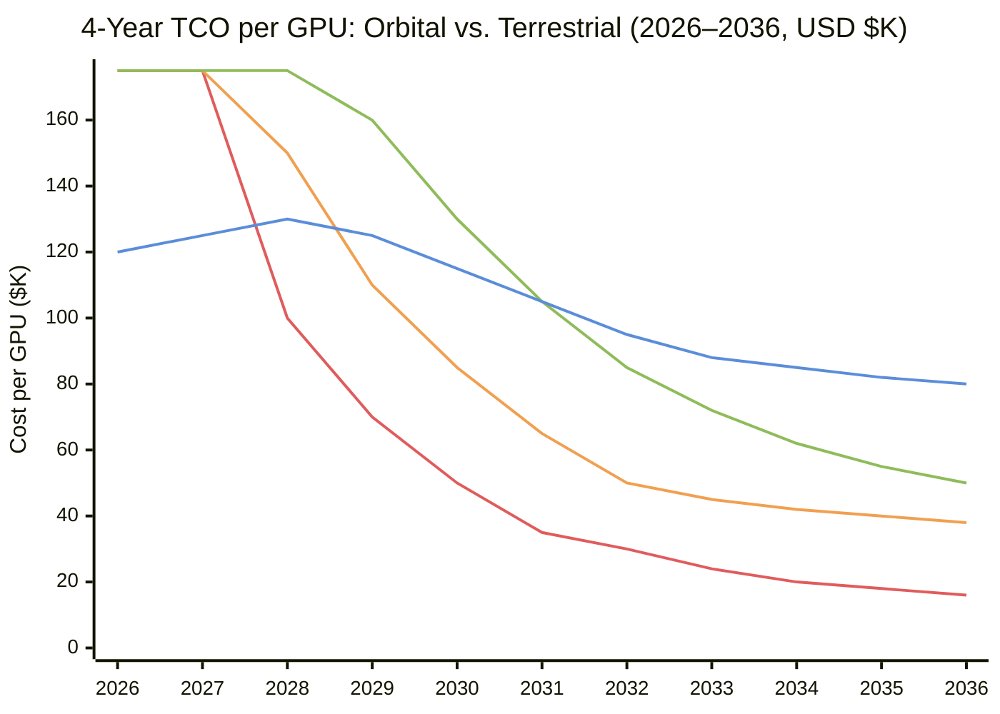

> **⚠ Disclaimer:** This entry may be incomplete, out of date, or inaccurate. It is AI-maintained on a best-effort basis. Do not rely on it as a sole source — verify claims independently using the sources listed below.

## Summary

This page provides a first-principles analysis of orbital compute economics: the physics of solar power generation in LEO, the GPU thermal and power budget in a space environment, the cost to build and launch a compute satellite, gaps in production-scale technology that must close, and a 10-year outlook on how the key cost drivers are likely to evolve. The conclusion is that orbital compute is plausible at scale by the mid-2030s under aggressive but achievable assumptions — primarily contingent on Starship launch cadence and the development of multi-Tbps inter-satellite optical links. Under conservative assumptions it remains uneconomic for most workloads through at least 2035.

---

## 1. Energy: The Physics of Solar Power in LEO

### Solar Irradiance

At Earth's surface, mid-latitude insolation averages roughly 150–250 W/m² over a full year after accounting for atmosphere, weather, and day/night cycles. In LEO, solar irradiance is approximately 1,361 W/m² (the solar constant) with no atmospheric attenuation. A satellite in a dawn-dusk sun-synchronous orbit (SSO) at ~550 km altitude maintains near-continuous solar exposure — roughly 90–95% illumination fraction — because the orbital plane tracks the terminator. The practical consequence: a 1 m² solar panel in a well-designed LEO SSO captures roughly 5–8× more annual energy than the same panel at a mid-latitude ground installation, and does so without battery storage for day/night cycling.

State-of-the-art triple-junction GaAs (gallium arsenide) solar cells, as used on most high-power satellites, achieve 28–32% conversion efficiency — compared to 22–24% for the best commercial silicon panels at scale. At 30% efficiency and 1,361 W/m² incident, a 1 m² array produces ~408 W at the beginning of life. End-of-life (EOL) efficiency after 5 years in LEO drops by roughly 5–15% due to proton and electron radiation degradation in the Van Allen belts; LEO at 550 km is substantially below the inner belt, limiting annual degradation to ~1–2% for well-shielded cells.

A practical 10 m² deployable solar array (roughly the size of a large SmallSat bus or a Starship payload-class panel module) produces approximately 3–4 kW at BOL — enough to run approximately one to two NVIDIA H100 GPUs at full TDP (700 W each in SXM5 form, or ~300–400 W in a power-capped configuration optimized for thermal balance).

### Thermal Management: The Vacuum Advantage

On Earth, data center cooling is a massive secondary cost: power usage effectiveness (PUE) ratios of 1.2–1.5 are typical, meaning 20–50% of total facility power is consumed by cooling. In vacuum, convective cooling is absent — but radiative cooling is highly effective. The Stefan-Boltzmann law governs radiative heat rejection: P = εσA(T⁴ − T_background⁴), where ε is emissivity, σ is 5.67×10⁻⁸ W/m²K⁴, A is radiator area, and T_background in LEO is approximately 3 K (deep space). At an operating junction temperature of 350 K (~77°C, a reasonable GPU operating point), a 1 m² radiator panel with emissivity 0.9 rejects approximately 770 W — enough to handle a thermally capped 300–400 W GPU with modest margin.

This means a well-engineered orbital compute satellite could in principle achieve PUE ≈ 1.0: the only power consumed is compute power, with no cooling overhead. In practice, power conversion losses, housekeeping electronics, attitude control, and communication systems consume 10–20% of total satellite power budget, giving realistic PUE equivalents of 1.1–1.2 — better than ground-based hyperscalers but not radically so.

The catch is heat spreading: GPUs generate very localized thermal loads (up to 300 W/cm² at the die), and conduction paths from die to radiator must be engineered carefully without convective assists. Vapor chambers, heat pipes (standard space technology), and direct liquid-cooled cold plates are viable — but add mass and complexity relative to terrestrial air-cooled racks.

### GPU Power Budget Summary

| Parameter | Value | Notes |
|-----------|-------|-------|
| NVIDIA H100 SXM5 TDP | 700 W | Full-performance, terrestrial spec |
| Power-capped H100 (space-optimized) | 300–400 W | ~60% throughput retained; common space practice |
| NVIDIA Blackwell B200 TDP | 1,000 W | Terrestrial full-spec |
| Power-capped B200 (space-optimized) | 400–600 W | Estimated; dependent on thermal design |
| Solar array area per GPU (H100 capped) | ~1 m² | At 400 W output from 10%-degraded panel |
| Radiator area per GPU (H100 capped) | ~0.5–1 m² | At 300–350 W rejection, 350 K operating temp |
| Achievable GPUs per 100 kg satellite | ~2–4 | Budget-constrained by solar + radiator mass |

The mass budget is the binding constraint, not raw energy availability. Each additional GPU requires roughly 1–2 m² of solar panel and 1 m² of radiator, both of which are light but voluminous. A 100 kg SmallSat bus (typical for current commercial LEO) can plausibly carry 2–4 power-capped H100s with aggressive mechanical design. A 1,000 kg dedicated compute satellite (roughly Starlink V3 mass class) could carry 20–40 GPUs.

---

## 2. Cost to Build and Place a Compute Satellite

### Satellite Build Cost

Satellite hardware costs break down into the compute payload, the bus (structure, power, attitude control, thermal, communications), and integration and test (I&T). Current benchmarks:

**Compute payload cost** is dominated by GPU cost. NVIDIA H100 SXM5 modules are approximately $25,000–$35,000 each at commercial pricing. Space-qualified or radiation-tolerant variants (if required) could add 2–5× for qualification, shielding, and low-volume procurement — though Starcloud's approach is to fly COTS (commercial off-the-shelf) hardware and accept some probability of radiation upsets rather than pay for space-grade qualification. At COTS pricing, 4 GPUs represent $100,000–$140,000 in silicon.

**SmallSat bus cost** at current production scale (100–500 kg class, moderate power, LEO): approximately $1–3M for a custom-designed bus, or $500K–$1M for a productized bus from vendors like York Space, Tyvak, or Blue Canyon Technologies. This will fall significantly at constellation scale with production line manufacturing.

**I&T and non-recurring engineering (NRE)**: For a first satellite, NRE dominates — $5–20M. Amortized across a constellation of 1,000+ satellites, NRE approaches zero per unit.

**Total per-satellite cost at scale (constellation of 1,000+):** Likely $500K–$1.5M per satellite for a 100–200 kg platform carrying 4–8 GPUs, once bus production is optimized. This is the target range cited by Starcloud and Aetherflux in their investor materials.

**Total per-satellite cost today (first units):** $5–20M inclusive of NRE, custom integration, and small-lot procurement.

### Launch Cost

Launch cost is expressed in $/kg to LEO and is the most discussed and most rapidly evolving variable in the orbital compute thesis.

| Launch Vehicle | $/kg to LEO (2026) | Status |
|----------------|-------------------|--------|
| Falcon 9 rideshare (Transporter) | ~$3,600/kg | Current production rate |
| Falcon 9 dedicated | ~$6,700/kg | Standard commercial pricing |
| Falcon Heavy | ~$3,000–$5,000/kg | Moderate cadence |
| Starship (projected at ~100 launches/yr) | ~$500–$1,000/kg | Target; not yet in commercial service |
| Starship (projected at ~1,000 launches/yr) | ~$100–$200/kg | Long-range SpaceX internal estimate |

A 200 kg compute satellite on a Falcon 9 rideshare costs approximately $720,000 in launch today. At $500/kg Starship pricing, the same satellite costs $100,000 to launch. At $100/kg (the SpaceX long-range aspiration), it's $20,000 — less than the GPU payload itself. This is the pivot point the orbital compute thesis depends on: once launch cost falls below GPU cost, the satellite becomes the cheap part and scaling becomes straightforward.

**Total deployed cost per GPU at scale:**

| Scenario | GPU cost | Satellite bus (4-GPU) | Launch (200 kg @ 4 GPUs) | Total per GPU |
|----------|----------|----------------------|--------------------------|---------------|
| Today (Falcon 9, first-unit hardware) | $30K | $5M+ | $180K | >$1.3M |
| Near-term (Falcon 9 rideshare, mature bus) | $30K | $250K | $180K | ~$115K |
| Mid-term (Starship $500/kg, mature bus) | $20K | $150K | $25K | ~$49K |
| Long-term ($100/kg, optimized bus) | $15K | $75K | $5K | ~$24K |

For comparison, terrestrial GPU deployment costs are substantially higher than raw GPU unit pricing alone — and have risen sharply with the transition from 40–50 kW air-cooled racks to 120 kW+ liquid-cooled racks for current-generation systems.

**Current-generation terrestrial TCO reality (as of 2026):**

The GPU hardware (H100 SXM5: $25K–$40K; B200: $30K–$50K) represents only roughly 35% of the five-year total cost of ownership. A realistic 5-year TCO model for 100 H100 GPUs puts total costs at approximately $8.6M — or about $86,000 per GPU over five years, ~$69,000 over four years. Infrastructure components driving this include:

- **Rack and server system:** An 8-GPU H100 server system costs $350K–$400K fully built ($18K–$24K per GPU in system cost alone, before facility infrastructure)
- **Facility power and cooling infrastructure:** For current-generation Blackwell-class deployments (GB200 NVL72 at 120 kW/rack), retrofitting or building liquid-cooled infrastructure runs $5–10M per MW in facility upgrades — approximately $600K–$1.2M per 120 kW rack, or $8K–$17K per GPU in infrastructure capex
- **Liquid cooling systems (CDU, cold plates, manifolds):** $200K–$300K per rack for a 100 kW+ installation; these costs are mandatory for GB200/Blackwell-class deployments, which cannot be air-cooled
- **Annual opex (power, cooling, maintenance, staff):** Approximately $31,000–$35,000 per GPU per year at scale, dominated by electricity and cooling

**Approximate 4-year TCO per GPU by generation and deployment tier:**

| Deployment | GPU cost | Server system delta | Infra capex | 4-yr opex | ~Total TCO (4 yr) |
|------------|----------|--------------------|--------------|-----------|--------------------|
| H100 in legacy air-cooled rack (40–50 kW) | $30–40K | $18–24K | $5–10K | $40–50K | ~$93–$124K |
| H100/H200 in purpose-built liquid-cooled facility | $30–40K | $18–24K | $15–25K | $35–45K | ~$98–$134K |
| GB200 NVL72 rack (120 kW, liquid-cooled) | $40–50K | ~$41K (rack/72) | $20–30K | $35–50K | ~$136–$171K |

These figures are meaningfully higher than the $50K–$60K figure sometimes cited in early orbital compute analyses, which were based on legacy 40–50 kW air-cooled rack economics. The shift to 120 kW+ liquid-cooled deployments — which is mandatory for current-generation GB200/Blackwell systems, and will be non-optional at the 600 kW/rack scale of Rubin/next-generation — increases terrestrial infrastructure capex and opex substantially. Notably, this dynamic cuts both ways: higher terrestrial TCO makes the orbital crossover case somewhat easier to achieve, but the same GPU generation advances that drive terrestrial rack density also increase the performance disadvantage of locked-in orbital hardware over time.

The crossover at which orbital total deployed cost per GPU becomes competitive with terrestrial TCO therefore requires roughly $200–300/kg launch pricing AND significant bus cost reduction AND COTS GPU pricing — a combination that could plausibly emerge by the early-to-mid 2030s at Starship production scale, but is not yet here. Importantly, the terrestrial TCO baseline that orbital compute must beat is itself a moving target: as rack densities climb from 120 kW (GB200) toward 600 kW (Rubin NVL144) and potentially 1 MW (projected next-generation), the infrastructure cost per GPU on the ground will continue rising — moderately improving the relative orbital case for future generations.

---

## 3. Technology Gaps at Production Scale

### 3.1 Inter-Satellite Links (ISLs): The Bandwidth Gap

This is the single most critical missing technology for orbital compute to support real AI workloads. Modern distributed GPU training — the target workload for any orbital cluster — requires extremely high-bandwidth, low-latency interconnects between GPUs. NVIDIA's NVLink operates at 900 GB/s between adjacent GPUs in a server. Even InfiniBand at 400 Gb/s (50 GB/s) is the standard fabric for inter-node GPU clusters on Earth.

Current inter-satellite optical link (ISL) technology — as demonstrated by Starlink's laser crosslinks and TESAT GmbH's SpaceDataHighway — achieves roughly 10–100 Gbps at distances of hundreds to thousands of km. Formation-flying satellites at 5–50 km separation, using purpose-built short-range optical ISLs, could plausibly achieve 1–10 Tbps per link — but this capability does not exist at production scale today. No current satellite vendor offers multi-Tbps ISLs as a standard product.

For context: training a GPT-4-class model requires aggregate interconnect bandwidth of multiple Tbps within the training cluster. An orbital cluster of 1,000 GPUs would need sustained terabit-class ISLs just to move gradient tensors during a training step. Current LEO ISL technology is 100–1,000× short of this requirement for large model training.

**Inference is far more tractable.** Single-model inference — serving queries from a pre-trained model — can run on a single satellite with no ISL requirement for latency-tolerant workloads. This is what Starcloud-1 demonstrated. The orbital ISL gap is a training problem, not an inference problem.

### 3.2 Radiation Hardening: HBM Memory Fragility

Commercial GPU dies (H100, Blackwell) are manufactured on 4–5 nm TSMC processes and operate without active radiation shielding. In LEO at 550 km, the primary radiation threat is galactic cosmic rays (GCRs) and trapped protons in the South Atlantic Anomaly (SAA). Single-event upsets (SEUs) in SRAM occur at rates of roughly 1–10 errors/day/GB in LEO, manageable via ECC (error-correcting code) — which modern GPU dies implement.

High-bandwidth memory (HBM) — the stacked DRAM that gives H100 its 3.35 TB/s memory bandwidth — is the more fragile subsystem. HBM uses thin-die stacking with minimal shielding, and its DRAM cells are inherently more susceptible to SEUs than SRAM. Accumulated total ionizing dose (TID) degrades HBM reliability over multi-year missions. Starcloud has not publicly disclosed its HBM reliability data from Starcloud-1 operations.

Current practice is to accept some SEU rate and rely on software-level error detection and restart. For inference, a corrupt forward pass can simply be discarded and retried — low cost. For training, a corrupted gradient step can corrupt model weights — potentially catastrophic. Production-scale orbital training clusters will require either radiation-hardened HBM (which does not currently exist at GPU-class bandwidth densities), active shielding (mass-prohibitive at scale), or orbital altitudes carefully chosen to minimize trapped radiation exposure.

### 3.3 High-Power Solar Arrays: Efficiency × Mass

At current technology, aerospace-grade triple-junction GaAs arrays achieve ~300–400 W/kg specific power (watts per kilogram of deployed array mass). This is respectable — commercial silicon panels are 150–200 W/kg — but still means that a 4 kW solar array (enough for ~8–10 power-capped GPUs) masses roughly 10–13 kg. At constellation scale this is manageable; for very large GPU counts per satellite (50–100+), the array mass begins to dominate the satellite design.

Emerging technologies — ultra-light thin-film perovskite arrays, advanced GaAs concentrator cells, and deployable flexible panel architectures — are targeting 500–1,000 W/kg specific power. These remain at TRL 4–5 (prototype demonstration) and are unlikely to be at production readiness before 2028–2030. Without them, satellites much above ~20 kW total power become impractical without very large physical structures.

### 3.4 High-Throughput Manufacturing: Satellite Production Lines

SpaceX produces Starlink satellites at roughly 20–40 per week. Purpose-built compute satellites with custom thermal and power architectures are nowhere near this production rate. Achieving constellation-scale deployment (thousands of compute satellites) requires automotive-style mass production — a capability no orbital compute company has demonstrated or designed toward yet as of 2026. Starcloud's 88,000-satellite FCC filing is a regulatory placeholder, not a production roadmap.

### 3.5 On-Orbit Servicing and GPU Replacement

Terrestrial data centers refresh GPU hardware every 3–5 years as new generations arrive. In orbit, hardware cannot be easily replaced. A satellite deployed in 2026 with H100s will still be running H100s in 2031 — while terrestrial competitors have moved to B200, B300, and beyond. This generational lock-in means orbital GPUs face increasing compute-per-dollar disadvantage over time relative to ground, not improving. On-orbit servicing (OOS) — physically visiting and replacing hardware — is in early development (Northrop OSAM-1, Astroscale) but is not a near-term solution for cost-competitive compute satellite servicing.

This is arguably the most underappreciated structural disadvantage of the orbital model. The economics require low enough $/GPU-hour that operating 5-year-old GPUs in orbit is still competitive with 1-year-old GPUs on the ground. That may be achievable at sufficiently low launch and operating costs, but it is not guaranteed.

---

## 4. Cost Drivers and 10-Year Outlook (2026–2036)

### 4.1 Launch Cost: The Dominant Variable

Everything in the orbital compute thesis flows from launch cost. The trajectory:

- **2026–2028:** Falcon 9 remains the workhouse at $3,000–$4,000/kg rideshare. Starship begins commercial payloads but at low cadence (< 20 launches/yr) and early pricing likely $1,000–$2,000/kg. No step-change in economics yet.
- **2028–2030:** Starship reaches 50–100 launches/year. Pricing likely falls to $400–$800/kg as learning-curve economics take hold and booster reuse matures. First constellations of 100–500 compute satellites become economically viable for well-funded operators.
- **2031–2033:** At 200–500 Starship launches/year, $100–$300/kg pricing becomes plausible. This is the window when orbital GPU TCO could match or beat terrestrial at scale. Competing launch vehicles (Blue Origin New Glenn, Rocket Lab Neutron, ULA Vulcan) provide redundancy and potentially further competitive pressure.
- **2034–2036:** If Starship achieves 1,000+ launches/year (SpaceX's stated aspiration), $50–$100/kg pricing is technically achievable. At this price point, launch cost becomes a minor line item and orbital compute becomes straightforwardly competitive for power-intensive workloads.

The risk: Starship cadence could plateau well below these projections. SpaceX achieved roughly 134 total launches across all vehicles in 2024; even at 2× growth per year, reaching 1,000 Starship-class launches per year by 2034 would be extraordinary. A more conservative base case is 200–300 launches/year by 2034, implying $150–$300/kg pricing — still transformative but not paradigm-shifting.

### 4.2 GPU Efficiency and Power Density

NVIDIA's roadmap shows roughly 2–3× compute-per-watt improvement per generation (B200 vs H100, and the projected Rubin architecture). Each generation makes the per-GPU power and thermal budget more manageable in a mass-constrained satellite. By 2030, a next-generation GPU may offer H100-class inference throughput at 150–200 W TDP — fitting 4 GPUs into a 1 kW power envelope, dramatically improving satellite compute density.

This dynamic is favorable: improving GPU efficiency reduces the solar array and radiator mass needed per unit of compute, improving the satellite build economics over time even before launch cost falls.

### 4.3 Solar Array Specific Power

The aerospace solar array industry is moving toward higher specific power (W/kg). Targets from NASA's SPINPH and ESA's advanced solar array programs point to 300–500 W/kg by 2030 and potentially 800–1,200 W/kg by 2035 for thin-film flexible arrays. If achieved at production scale, this would allow a 10 kW solar array in well under 20 kg of panel mass — enabling 20–25 GPU satellites at under 150 kg total mass. This is the configuration that would make orbital GPU economics genuinely compelling.

### 4.4 ISL Technology

Optical ISL technology is on a clear improvement trajectory driven by both space and terrestrial photonics advances. Point-ahead angle tracking, coherent modulation, and adaptive optics for short-range ISL are all active development areas. By 2030–2032, 100 Gbps per ISL at <50 km satellite separation is achievable. Multi-Tbps cluster-class ISLs (1–10 Tbps) likely require 2033–2036 for production readiness. This means orbital GPU training clusters at scale are a 2033–2036 story, not a 2028 story.

### 4.5 Summary Cost Projection

| Year | Launch ($/kg) | Per-GPU deployed cost | Competitive with terrestrial? |
|------|---------------|-----------------------|-------------------------------|
| 2026 | $3,500 | >$1M | No — 20–50× worse |
| 2028 | $800 | ~$100K | No — 2–3× worse |
| 2030 | $400 | ~$50K | Approaching parity for power-constrained sites |
| 2032 | $200 | ~$30K | Parity or slight advantage for specific workloads |
| 2035 | $100 | ~$18K | Competitive for inference; training still constrained by ISLs |

Note: These projections assume aggressive Starship ramp, COTS GPU pricing, and production-scale satellite manufacturing. Under conservative assumptions (Starship at 200 launches/yr, no alternative heavy lift competition), 2035 per-GPU costs are likely $30–$50K — still competitive but not dominant.

*(Orbital costs in 2026–2027 are well above the chart scale — >$400K–$1M/GPU — and are clipped at the axis ceiling. The chart is scaled to show the crossover region.)*

  <svg width="28" height="10"><line x1="0" y1="5" x2="28" y2="5" stroke="#e05c5c" stroke-width="2.5"/></svg> Orbital – Aggressive (Starship ~1,000 launches/yr by 2034)
  <svg width="28" height="10"><line x1="0" y1="5" x2="28" y2="5" stroke="#f0a050" stroke-width="2.5"/></svg> Orbital – Conservative (Starship ~200 launches/yr plateau)
  <svg width="28" height="10"><line x1="0" y1="5" x2="28" y2="5" stroke="#8fbc5a" stroke-width="2.5"/></svg> Orbital – Realistic (anchored to known contract data)
  <svg width="28" height="10"><line x1="0" y1="5" x2="28" y2="5" stroke="#5b8dd9" stroke-width="2.5"/></svg> Terrestrial TCO (hardware + infra + 4-yr opex)

*Orbital – Aggressive* assumes Starship reaches ~200 launches/yr by 2030 and ~1,000/yr by 2034, with production-scale satellite manufacturing and COTS GPU pricing. *Orbital – Conservative* assumes Starship plateaus at ~200 launches/yr through 2034 with no competing heavy lift. *Orbital – Realistic* is anchored to the most concrete public pricing data available: Voyager Technologies' Starlab contract implies ~$90M per Starship launch in 2029, which at 150t payload capacity equals ~$600/kg — producing a per-GPU deployed cost of roughly $160K in 2029 before bus cost reductions mature. The realistic series then assumes gradual cadence growth to 100–150 launches/yr by 2032 (~$300–400/kg) and 200 launches/yr by 2035 (~$200/kg), with Falcon 9 rideshare at $3,500/kg remaining the primary option through 2028. On this trajectory, orbital does **not** cross terrestrial TCO within the 2026–2036 window — the lines converge but parity is a post-2036 outcome. *Terrestrial TCO* reflects 4-year total cost of ownership per GPU including hardware, server system, liquid-cooled facility infrastructure, and opex. Crossover under the aggressive scenario occurs around **2031–2032**; under the conservative scenario, around **2034–2035**; under the realistic scenario, **beyond 2036**.

---

## 5. The Genuine Economic Case (and Where It Breaks Down)

### Where orbital compute has a real structural advantage

The terrestrial AI build-out faces two hard constraints: power grid interconnection queues (18–36 months in many US markets) and water consumption for cooling in water-stressed regions. A constellation of compute satellites that can be deployed in 12–18 months at launch-cost parity with a terrestrial build could credibly capture the market for buyers who cannot wait for grid access.

Additionally, for certain workloads — satellite imagery inference, Earth observation analytics, sovereign AI for nations without datacenter infrastructure, low-latency inference for equatorial users — orbital placement is a functional advantage beyond just cost. These niche markets could sustain orbital compute at modest scale even before full terrestrial cost parity.

### Where the case is weak or speculative

The case for orbital compute as a mass-market replacement for terrestrial hyperscale GPU clusters is much weaker. On-orbit hardware aging and the inability to upgrade GPUs means the compute density advantage compounds in favor of ground over time. The ISL gap means large model training is not feasible in orbit at scale for at least a decade. The upfront capital intensity (satellite manufacturing + launch) requires very long asset lives to amortize — contrasted with terrestrial GPU clusters that can be upgraded or redeployed within months.

The companies most exposed to these risks are those targeting "orbital hyperscale" — constellations of thousands of satellites with training-class workloads. The companies with the strongest near-term business case are those targeting inference-only workloads on small constellations with modest GPU counts, in specific geographic or application niches.

---

## Key Uncertainties

The analysis above is sensitive to several variables that carry high uncertainty and could shift the timeline by 5+ years in either direction.

Starship launch cadence is the dominant unknown. If SpaceX's legal, regulatory, or technical challenges slow the ramp — or if a competitor (New Glenn, Neutron) captures a significant portion of the LEO market — launch costs may not fall as fast as the aggressive case assumes.

Regulatory bottlenecks are underappreciated. FCC spectrum licensing, orbital debris rules (ITU coordination, active debris removal requirements), and US export controls on advanced semiconductor exports to space (which become relevant if satellites are operated by non-US entities) could impose timeline and cost risks that are difficult to model.

GPU export controls are a latent risk. NVIDIA's advanced GPU exports are already subject to US Department of Commerce controls. If these controls are extended to cover deployment in orbit over adversarial territories, it could constrain the operational flexibility of orbital compute operators — or their ability to sell compute services to non-US buyers.

Finally, the pace of terrestrial alternatives matters. If behind-the-meter nuclear (Oklo, Kairos, TerraPower), direct-connect gas turbines, or other on-site power solutions solve the grid interconnection bottleneck for terrestrial data centers, the primary market rationale for orbital compute (grid access is the constraint) weakens considerably.

## Sources

- NASA Small Satellite Technology State of the Art: [https://www.nasa.gov/smallsat-institute/sst-soa/power/](https://www.nasa.gov/smallsat-institute/sst-soa/power/)
- SpaceX Starship launch cost projections: [SpaceNews analysis](https://spacenews.com/spacex-starship-launch-cost-projections/)
- LEO radiation environment and GPU SEU rates: [Acta Astronautica / ScienceDirect](https://www.sciencedirect.com/science/article/pii/S0273117722009541)
- NVIDIA H100 SXM5 specifications: [NVIDIA product page](https://www.nvidia.com/en-us/data-center/h100/)
- Solar array specific power benchmarks: NASA Glenn Research Center, Advanced Solar Array technology program
- Starcloud-1 mission data: see [Starcloud entry]()
- Aetherflux SBSP architecture: see [Aetherflux entry]()
