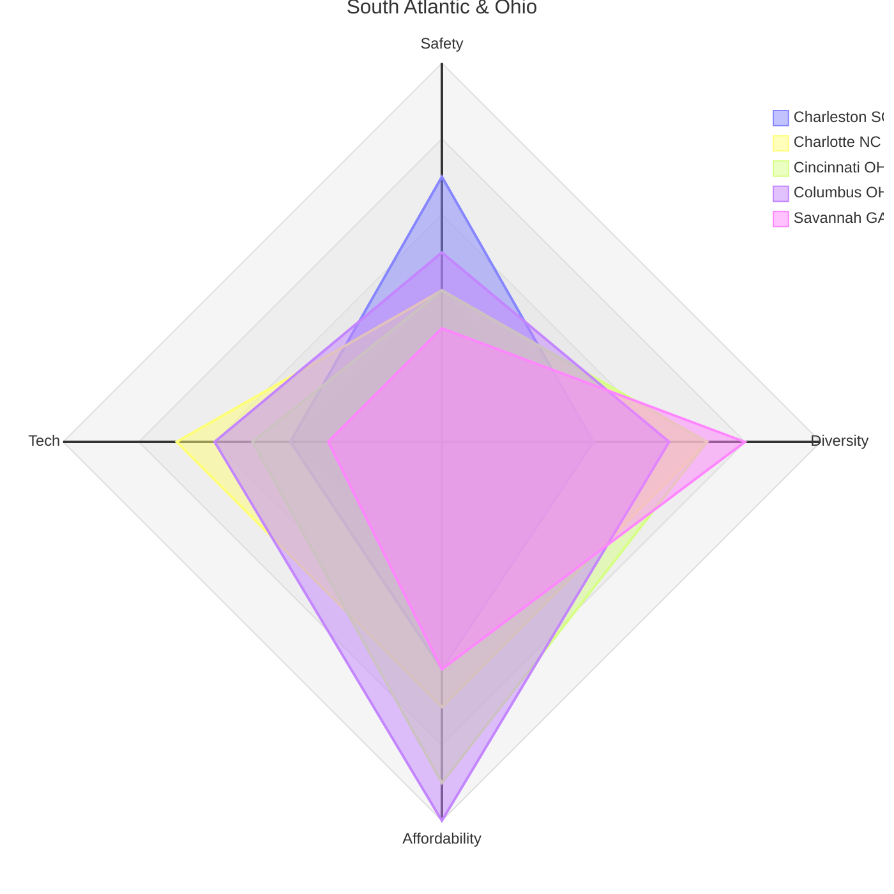
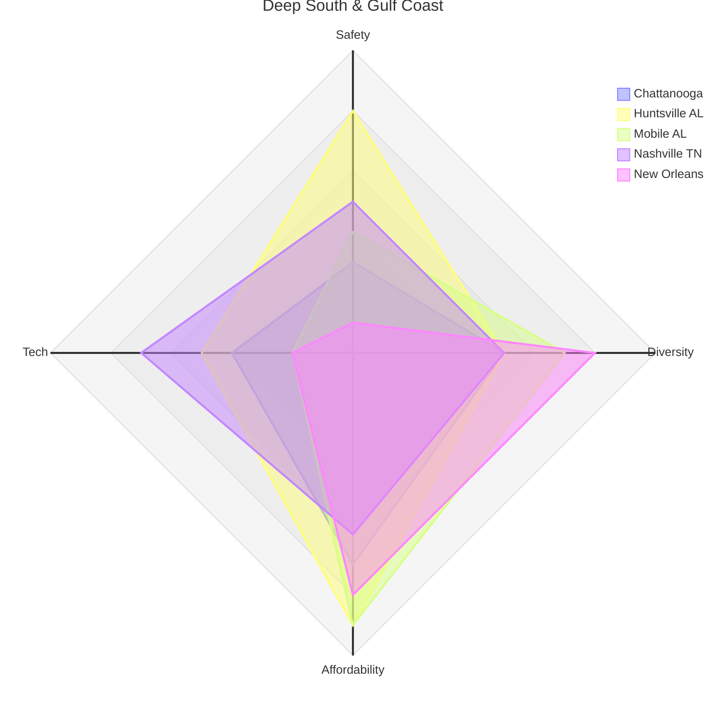
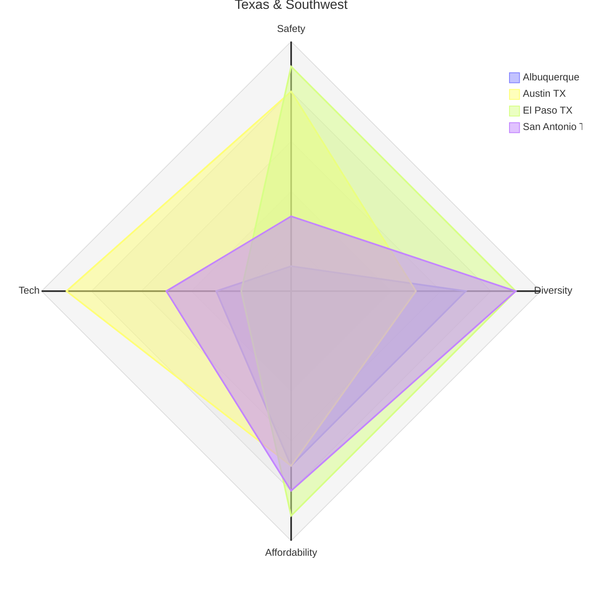
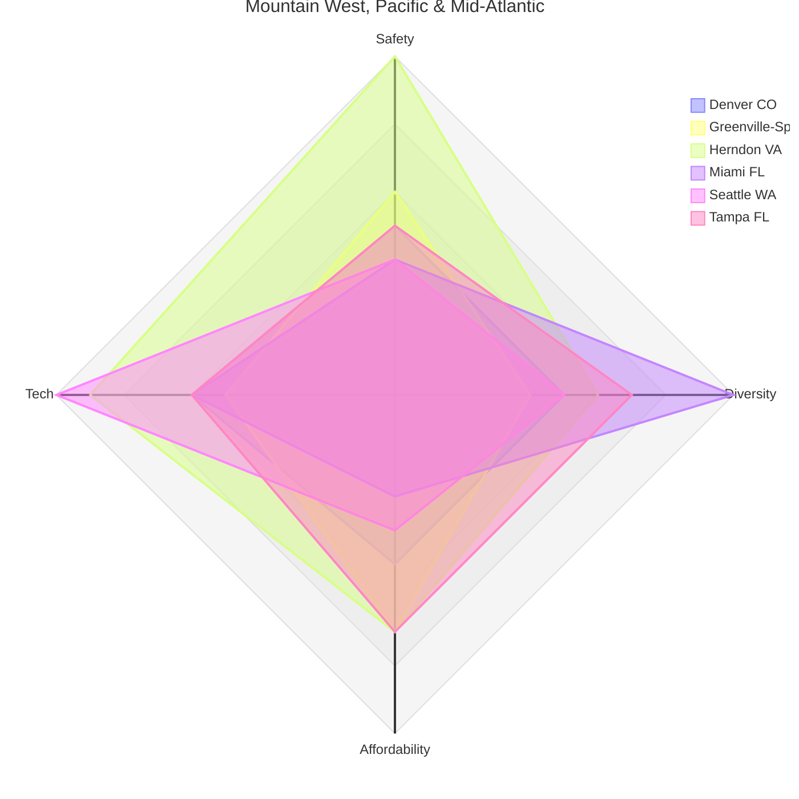
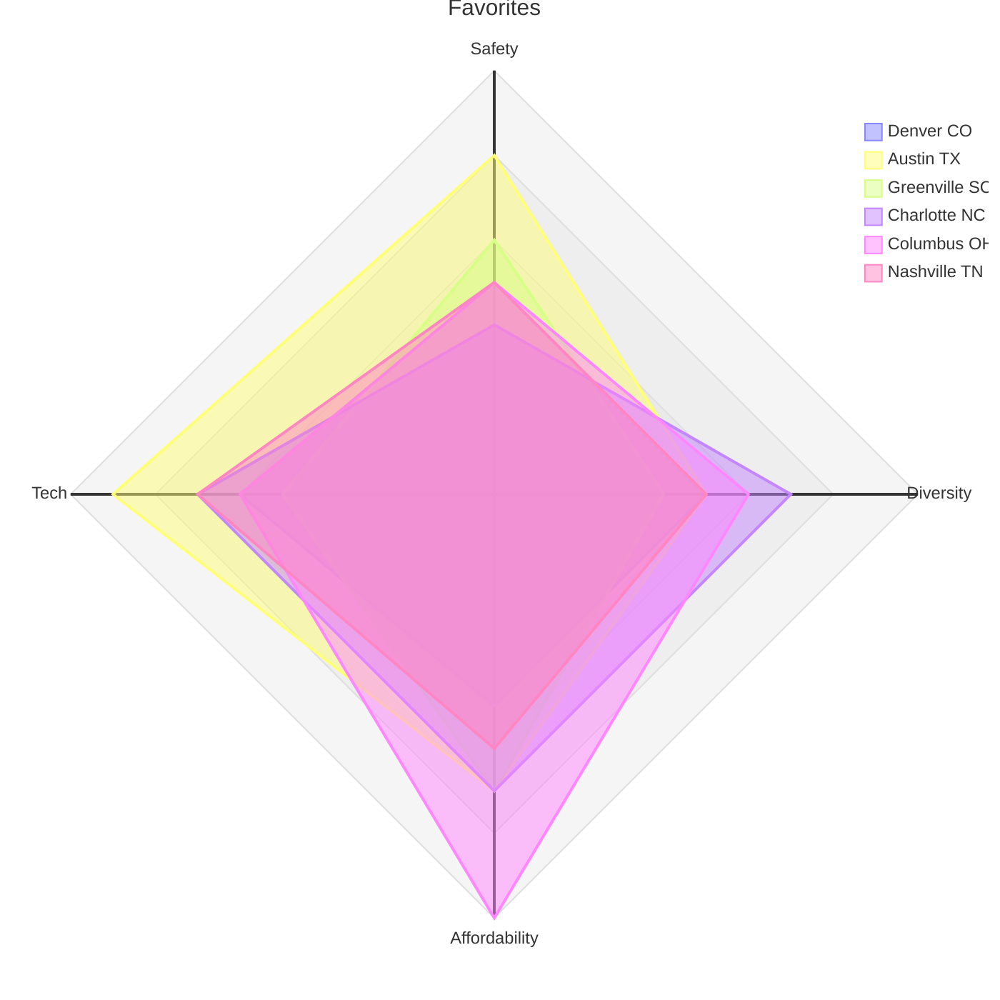

> **⚠ Disclaimer:** Scores are normalized estimates derived from profile data as of mid-2026. They are intended for relative comparison only — not precise rankings. Verify figures independently before making decisions. See individual city profiles for sourced detail.

This page compares all 20 US city profiles across four dimensions:

- **Safety** — normalized crime score (higher = safer); based on violent and property crime rates per capita vs. national average
- **Diversity** — share of non-white-non-Hispanic population as a proxy for demographic diversity; higher = more diverse
- **Affordability** — inverse of median home price ÷ median household income; higher = more affordable relative to local wages
- **Tech** — composite of private-sector tech company count and size, unemployment rate and trend, and net corporate relocation activity (companies moving in vs. out)

All scores are on a 1–10 scale. Cities are grouped into four regional clusters for readability.

---

## Group 1 — South Atlantic

| City | Safety | Diversity | Affordability | Tech |
|------|--------|-----------|---------------|------|
| Charleston, SC | 7 | 4 | 6 | 4 |
| Charlotte, NC | 4 | 7 | 7 | 7 |
| Cincinnati, OH | 4 | 7 | 9 | 5 |
| Columbus, OH | 5 | 6 | 10 | 6 |
| Savannah, GA | 3 | 8 | 6 | 3 |

**Key takeaways:** Columbus is the standout affordability winner — ~$230K median home against strong wages, anchored by Intel's $28B investment. Cincinnati posts the group's strongest diversity score alongside strong affordability, driven by eight Fortune 500 HQs and a world-class data science ecosystem at Kroger/84.51°. Charlotte leads on tech depth with BofA, Honeywell, and Truist HQs. Charleston wins on safety but its cost premium relative to income is the highest in this group. Savannah has the best raw diversity score but the weakest safety and tech pictures.

---

## Group 2 — Deep South & Gulf Coast

| City | Safety | Diversity | Affordability | Tech |
|------|--------|-----------|---------------|------|
| Chattanooga, TN | 3 | 5 | 7 | 4 |
| Huntsville, AL | 8 | 5 | 9 | 5 |
| Mobile, AL | 4 | 7 | 9 | 2 |
| Nashville, TN | 5 | 5 | 6 | 7 |
| New Orleans, LA | 1 | 8 | 8 | 2 |

**Key takeaways:** Huntsville is the group's best safety-affordability combination — STEM wages at Alabama costs, with a deep defense/aerospace tech niche. Nashville leads on tech with Oracle's designated world HQ and HCA Healthcare anchoring a growing startup layer. Mobile matches Huntsville on affordability but has virtually no tech ecosystem and a declining population. New Orleans' strong affordability and diversity are severely undercut by the worst crime rate in the entire series.

---

## Group 3 — Texas & Southwest

| City | Safety | Diversity | Affordability | Tech |
|------|--------|-----------|---------------|------|
| Albuquerque, NM | 1 | 7 | 7 | 3 |
| Austin, TX | 8 | 5 | 7 | 9 |
| El Paso, TX | 9 | 9 | 9 | 2 |
| San Antonio, TX | 3 | 9 | 8 | 5 |

**Key takeaways:** Austin dominates on tech — the #6 US startup ecosystem, with Oracle, Dell, Tesla, and a wave of California corporate relocations. El Paso is the group's statistical outlier: exceptional safety, the highest diversity score in the series, and strong affordability — but nearly no private-sector tech. The combination holds only if you're remote or in defense/government. Albuquerque's affordability advantage is nearly erased by its crime picture, the worst of any city in this series. San Antonio offers strong diversity and affordability with a growing cyber cluster, but crime is elevated.

---

## Group 4 — Mountain West, Pacific & Mid-Atlantic

| City | Safety | Diversity | Affordability | Tech |
|------|--------|-----------|---------------|------|
| Denver, CO | 5 | 5 | 5 | 6 |
| Greenville-Spartanburg, SC | 6 | 4 | 7 | 5 |
| Herndon, VA (NoVA) | 10 | 6 | 7 | 9 |
| Miami, FL | 4 | 10 | 3 | 6 |
| Seattle, WA | 4 | 5 | 4 | 10 |
| Tampa, FL | 5 | 7 | 7 | 6 |

**Key takeaways:** Seattle is the only true tier-1 tech market in the series (Amazon + Microsoft HQs) but posts the worst affordability score alongside crime rates above the national average — a tradeoff the tech salary premium partially offsets. Herndon/NoVA leads the entire series on safety and has the deepest defense/intel/cyber job market, with Amazon HQ2 as a commercial anchor. Miami wins on diversity but is the affordability outlier of this group. Tampa is the balanced mid-tier pick — decent across all four dimensions without excelling at any. Greenville-Spartanburg is the value play for manufacturing-tech careers with SC's favorable tax and regulatory environment.

---

## Favorites Comparison

| City | Safety | Diversity | Affordability | Tech |
|------|--------|-----------|---------------|------|
| Denver, CO | 5 | 5 | 5 | 6 |
| Austin, TX | 8 | 5 | 7 | 9 |
| Greenville-Spartanburg, SC | 6 | 4 | 7 | 5 |
| Charlotte, NC | 4 | 7 | 7 | 7 |
| Columbus, OH | 5 | 6 | 10 | 6 |
| Nashville, TN | 5 | 5 | 6 | 7 |

**Key takeaways:** Austin leads decisively on tech and safety. Columbus is the affordability outlier of the group — no other favorite comes close on the price-to-income ratio. Charlotte and Nashville are the most balanced, both scoring 7 on tech and affordability with reasonable diversity. Greenville is the low-cost SC option with manufacturing-tech depth. Denver trails the group on affordability and doesn't clearly lead on any single dimension, but is the strongest outdoor-lifestyle and startup-culture option in the Mountain West.

---

## All-City Summary Table

Sorted by total score descending. Scores weight all four dimensions equally.

| City | Safety | Diversity | Affordability | Tech | Total |
|------|--------|-----------|---------------|------|-------|
| Herndon, VA | 10 | 6 | 7 | 9 | **32** |
| Austin, TX | 8 | 5 | 7 | 9 | **29** |
| El Paso, TX | 9 | 9 | 9 | 2 | **29** |
| Huntsville, AL | 8 | 5 | 9 | 5 | **27** |
| Columbus, OH | 5 | 6 | 10 | 6 | **27** |
| Cincinnati, OH | 4 | 7 | 9 | 5 | **25** |
| Charlotte, NC | 4 | 7 | 7 | 7 | **25** |
| Tampa, FL | 5 | 7 | 7 | 6 | **25** |
| San Antonio, TX | 3 | 9 | 8 | 5 | **25** |
| Nashville, TN | 5 | 5 | 6 | 7 | **23** |
| Seattle, WA | 4 | 5 | 4 | 10 | **23** |
| Miami, FL | 4 | 10 | 3 | 6 | **23** |
| Greenville-Spart, SC | 6 | 4 | 7 | 5 | **22** |
| Mobile, AL | 4 | 7 | 9 | 2 | **22** |
| Denver, CO | 5 | 5 | 5 | 6 | **21** |
| Charleston, SC | 7 | 4 | 6 | 4 | **21** |
| Savannah, GA | 3 | 8 | 6 | 3 | **20** |
| Chattanooga, TN | 3 | 5 | 7 | 4 | **19** |
| New Orleans, LA | 1 | 8 | 8 | 2 | **19** |
| Albuquerque, NM | 1 | 7 | 7 | 3 | **18** |

> Total scores weight all four dimensions equally. A city that excels on your specific priorities may rank higher in practice than its total suggests.

---

## Scoring Methodology

### Safety (1–10)
Derived from violent crime rates per 1,000 residents, property crime rates, and direction of trend vs. national average. National average violent crime rate (~4 per 1,000) anchors the midpoint.

| Score | Interpretation |
|-------|----------------|
| 9–10 | Well below national average; among safest large US markets |
| 7–8 | Below or near national average with improving trend |
| 5–6 | Near national average; neighborhood selection important |
| 3–4 | Above national average; elevated risk in city proper |
| 1–2 | Significantly above national average; high-crime city |

### Diversity (1–10)
Percentage of population identifying as non-white-non-Hispanic (minority share), used as a proxy for demographic diversity. Does not capture economic, political, or cultural diversity.

| Score | Approx. Minority Share |
|-------|------------------------|
| 9–10 | 75%+ |
| 7–8 | 55–74% |
| 5–6 | 38–54% |
| 3–4 | 25–37% |
| 1–2 | Under 25% |

### Affordability (1–10)
Inverse of the ratio of median home sale price to median household income. Lower price-to-income ratio = higher score. Captures purchasing power relative to local wages, not absolute price level.

| Score | Price/Income Ratio | Interpretation |
|-------|-------------------|----------------|
| 9–10 | 3.5–4.5× | Highly affordable relative to local wages |
| 7–8 | 4.5–6.5× | Reasonable stretch; attainable on median income |
| 5–6 | 6.5–7.5× | Significant stretch; requires dual income or savings |
| 3–4 | 7.5–10× | Difficult; priced out at median income |
| 1–2 | 10×+ | Severe affordability crisis |

### Tech (1–10)
Composite of four factors: number and variety of private-sector tech companies, size and anchor-employer quality (Fortune 500 HQs, major corporate relocations in), local unemployment rate and trend, and net corporate relocation momentum. Defense-only or single-sector depth scores lower than a broad commercial ecosystem.

| Score | Interpretation |
|-------|----------------|
| 9–10 | Tier-1 tech hub; major HQ presence; strong VC; net corporate in-migration |
| 7–8 | Regional hub; multiple Fortune 500 anchors; growing startup layer |
| 5–6 | Emerging market; one or two major anchors; some VC/startup activity |
| 3–4 | Niche depth only (defense, manufacturing, or single-sector); thin commercial tech |
| 1–2 | Minimal private-sector tech; remote workers come for lifestyle, not jobs |

---

## Individual City Profiles

[Albuquerque, NM]() · [Austin, TX]() · [Charleston, SC]() · [Charlotte, NC]() · [Chattanooga, TN]() · [Cincinnati, OH]() · [Columbus, OH]() · [Denver, CO]() · [El Paso, TX]() · [Greenville-Spartanburg, SC]() · [Herndon, VA]() · [Huntsville, AL]() · [Miami, FL]() · [Mobile, AL]() · [Nashville, TN]() · [New Orleans, LA]() · [San Antonio, TX]() · [Savannah, GA]() · [Seattle, WA]() · [Tampa, FL]()
